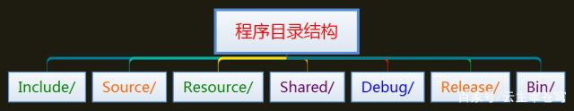
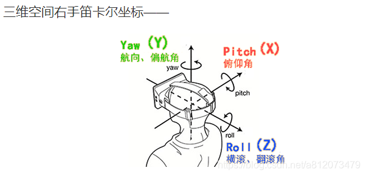
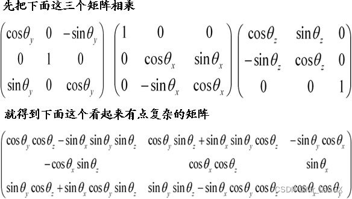
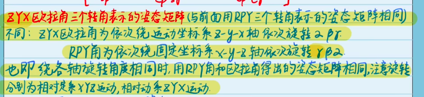
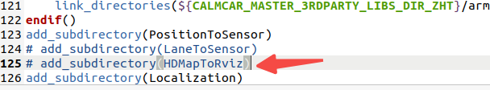

# 可视化
注意：现在生成的可执行文件CpApOdom已经改到Calmcar_Pilot/04_SWC/CpApOdom/01_bin/SWCS下，注意要把配置文件.yaml复制过去，在改动odom.sh的执行路径即可。

**按照方法1运行程序时**：没有路径线

此时需要修改tools里的boot_all_offline.sh或boot_all.sh，里面默认把odom注释掉了，取消注释即可，如下。

**按照方法2运行此程序时**：

# 接口

proto文件都在08_interfaces/proto文件夹下


## 程序文件的目录结构

1、Include目录下用于存放应用程序的头文件集合，也就是.h文件集合，在这个目录下面还可以根据需要划分子目录。

2、Source目录用于存放应用程序的源代码文件集合，也就是.c或者.cpp文件集合，在这个目录下也可以根据需要进行划分子目录。

3、Resource目录用于存放应用程序的一些资源文件，比如图片、视频、音频、对话框、图标以及光标等等，同样也可以划分几个子目录，便于管理。

4、Shared目录用于存放应用程序的一些共享文件。

5、Debug目录用于存放应用程序进行调试时的调试版本产生的中间文件。

6、Release目录用于存放应用程序进行发布时的发布版本产生的中间文件。

7、Bin目录用于存放程序猿自己创建的lib文件或dll文件。
————————————————
版权声明：本文为CSDN博主「_大峰_」的原创文章，遵循CC 4.0 BY-SA版权协议，转载请附上原文出处链接及本声明。
原文链接：https://blog.csdn.net/weixin_43336281/article/details/100105758
## RPY角和欧拉角
### pitch、yaw、roll三个角的区别

“欧拉角是用来唯一地确定定点转动刚体位置的三个一组独立角参量，由章动角θ、进动角ψ和自转角φ组成，为L.欧拉首先提出，故得名。它们有多种取法，下面是常见的一种”

三个角分别是Yaw,Pitch,Roll。可以这样简单的理解：Yaw 表示绕Z轴的偏航角度，Pitch表示绕X轴旋转的俯仰角度，Roll表示绕Y轴旋转的纵向翻滚角度。也就是说，任意的旋转角度都可以通过这三次按照先后顺序旋转得到。矩阵很难让人具体形象表示，欧拉角就容易多了。注意可能很多地方三个角的先后次序不一样

我们知道可以先把这三个矩阵相乘，这样可以节约计算量。就是要先计算这三个矩阵相乘，注意矩阵相乘次序是不可更改的，更改了结果就不一样了。欧拉角的三个角，可以转变为矩阵与矩阵的相乘。
已知pyr求旋转矩阵：由三个基本旋转矩阵从右到左依次相乘得到旋转矩阵。

已知旋转矩阵求pyr。
反正切函数求
### 欧拉角



## template
emplate <typename T> 是C++中用于定义模板的固定格式。模板是实现代码重用机制的一种工具，它可以实现类型参数化，即把类型定义为参数， 从而实现了真正的代码可重用性。模版可以分为两类，一个是函数模版，另外一个是类模版。

第一，函数模板。
功能要求：我们需要对int、char、string、double等类型的数据做交换操作，假如没有模板这种重用代码的机制，则我们需要根据不同的参数类型编写多个语句基本相同的函数，有了模板功能，则只需要编写一个函数即可，编译器可以通过输入参数的类型，推断出形参的类型。范例代码如下：
```cpp
#include<iostream>
#include<string>
using namespace std;

//template 关键字告诉C++编译器 下面是个泛型模板  
//数据类型T 参数化数据类型
template <typename T>
void generic_swap(T& a, T& b)
{
    cout << "Initial value: " << a << " : " << b << endl;

    T tmp;
    tmp = b;
    b = a;
    a = tmp;
}

int main()
{
    int a = 100, b = 50;
    generic_swap(a, b);
    cout << "excute the swap():" << a << " : " << b << endl;


    char c = 'A', d = 'B';
    generic_swap(c, d);
    cout << "excute the swap():" << c << " : " << d << endl;
    
    string e = "Jacky", f = "Lucy";
    generic_swap(e, f);
    cout << "excute the swap():" << e << " : " << f << endl;

    double j = 1.314, k = 5.12;
    generic_swap(j, k);
    cout << "excute the swap():" << j << " : " << k << endl;
    
    return 0;
}
```
作者：LabVIEW_Python
链接：https://www.jianshu.com/p/90bad1ef3431
来源：简书
著作权归作者所有。商业转载请联系作者获得授权，非商业转载请注明出处。
## c++中双冒号的作用

SoloLinux

于 2011-07-09 10:33:17 发布

6249
 收藏 5
文章标签： c++ iostream class compiler variables access
::是C++里的“作用域分解运算符”。比如声明了一个类A，类A里声明了一个成员函数voidf()，
但没有在类的声明里给出f的定义，那么在类外定义f时，就要写成voidA::f()，表示这个f()函数是类A的成员函数。
　　:: 一般还有一种用法，就是直接用在全局函数前，表示是全局函数。当类的成员函数跟类外的一个全局函数同名时，
大提示在类内定义的时候，打此函数名默认调用的是本身的成员函数；如果要调用同名的全局函数时，就必须打上::以示区别。
比如在VC里，你可以在调用API函数时，在API函数名前加::。
 
 
 
 
 中的域区分符号（双冒号：：）作用
A. 标识作用域的级别
B. 标识成员属于哪个类
C. 限定成员的作用范围
D. 指出作用域的范围
 
作用域符号::的前面一般是类名称，后面一般是该类的成员名称，C++为例避免不同的类有名称相同的成员而采用作用域的方式进行区分
如：A,B表示两个类，在A,B中都有成员member。那么
 A::member就表示类A中的成员member
 B::member就表示类B中的成员member 
 ## c++中std::deque的使用
  std::deque是双端队列，可以高效的在头尾两端插入和删除元素，在std::deque两端插入和删除并不会使其它元素的指针或引用失效。在接口上和std::vector相似。std::deque的存储空间会自动按需扩大和缩小。扩大std::deque比扩大std::vector要便宜，因为它不涉及到现有元素复制到新的内存位置。 双端队列（Double-ended queue，缩写为Deque）是一个大小可以动态变化（Dynamic size）且可以在两端扩展或收缩的顺序容器。顺序容器中的元素按照严格的线性顺序排序。可以通过元素在序列中的位置访问对应的元素。
  一个容器就是一些特定类型对象的集合。顺序容器(sequential container)为程序员提供了控制元素存储和访问顺序的能力。这种顺序不依赖于元素的值，而是与元素加入容器时的位置相对应。

         标准库中的顺序容器包括：

         (1)、vector：可变大小数组。支持快速随机访问。在尾部之外的位置插入或删除元素可能很慢。

         (2)、deque：双端队列。支持快速随机访问。在头尾位置插入/删除速度很快。

         (3)、list：双向链表。只支持双向顺序访问。在list中任何位置进行插入/删除操作速度都很快。

         (4)、forward_list：单向链表。只支持单向顺序访问。在链表任何位置进行插入/删除操作速度都很快。

         (5)、array：固定大小数组。支持快速随机访问。不能添加或删除元素。

         (6)、string：与vector相似的容器，但专门用于保存字符。随机访问快。在尾部插入/删除速度快。
————————————————
版权声明：本文为CSDN博主「fengbingchun」的原创文章，遵循CC 4.0 BY-SA版权协议，转载请附上原文出处链接及本声明。
原文链接：https://blog.csdn.net/fengbingchun/article/details/72757856

cpapodom      白
cpapinstoehr 白
cpaplocation... 江
三个


在自己电脑编译arm 上传arm版本
**可执行程序 configure配置文件 放到一个文件夹里压缩一下zip**
curl - （zip） http：。。。。piolt/ （zip）
写个txt说明文件  
20230519改动了CpApPosToEHP中的CMakeLists中的HDMapToRviz的编译

odom航迹推算 刚体运动 等等 基础知识

侯杰的c++书籍 快速浏览
国产int8做量化 nvidia fp32