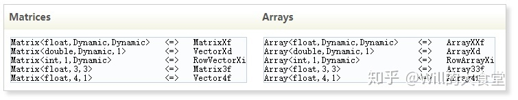
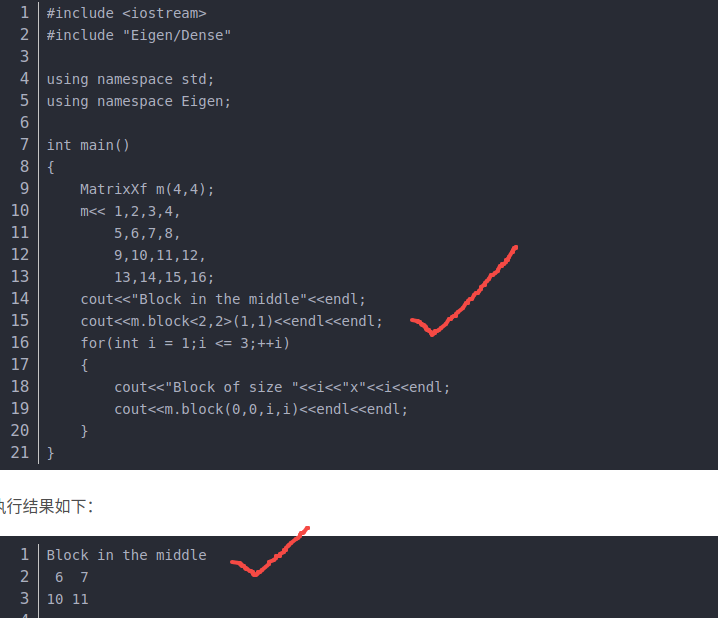

# Eigen
https://zhuanlan.zhihu.com/p/293023673

## Eigen子矩阵操作(block)
  比如：block<3,3>(0,0) 表示选取 rotation_matrix 中从(0,0)开始的一个3x3的矩阵。

https://blog.csdn.net/qq_27251141/article/details/90442072
## Eigen中四元数Quaterniond的初始化
```c++
Eigen::Quaterniond q1(w, x, y, z);// 第一种方式
 
Eigen::Quaterniond q2(Vector4d(x, y, z, w));// 第二种方式
 
Eigen::Quaterniond q2(Matrix3d(R));// 第三种方式
```
https://blog.csdn.net/hjwang1/article/details/106752766
## Eigen << 赋值符号
delta_dr_transform.speed_matrix << delta_dr_transform.speed.x, delta_dr_transform.speed.y, delta_dr_transform.speed.z;
Answer :

Share icon
这段代码将delta_dr_transform的速度向量的x、y、z分量赋值给speed_matrix矩阵。 
 分解代码： 
- "<<"符号是Eigen中矩阵赋值的一种方式，表示将右侧向量的值赋给左侧矩阵。 
- delta_dr_transform是一个结构体或类，它有一个名为speed的成员变量，表示速度向量。 
- speed_matrix是一个Eigen库中的矩阵，它有三行一列，即一个三维向量。 
- delta_dr_transform.speed.x表示delta_dr_transform的速度向量在x方向上的分量，y和z同理。
# ProtoBuf
\#include <google/protobuf/io/coded_stream.h>  
//该文件包含CodedInputStream和CodedOutputStream类，它们分别包装了ZeroCopyInputStream或ZeroCopyOutputStream，并允许您以各种格式读取或写入单个数据块。
## .pb.h 和 .pb.cc 文件？
https://blog.csdn.net/ouyang_peng/article/details/126929753
结论：其实.pb.h 和 .pb.cc 文件就是 protoc编译器根据 .proto 文件，编译生成对应的头文件和实现文件。
# YAML
https://blog.csdn.net/fengbingchun/article/details/89976302
yaml-cpp是用c++实现的用来解析和生成yaml文件的
# std::chrono
C++11 新的计时方法——std::chrono 
https://blog.csdn.net/u013390476/article/details/50209603
# 命名空间以及自定义命名空间
https://blog.csdn.net/weixin_43796685/article/details/101391950
# mutex
比如两个线程同时都对全局变量（公共资源）进行读写，可能会出现错乱，需要对不安全的代码端进行保护。mutex互斥量可以在代码运行时先上锁，当一个线程读写时其他线程不能访，当这个线程读写完后进行解锁，其他线程才能再进行读写。

上锁方法：
```
std::mutex mtx1;
```
死锁：还没解锁就return等操作了，这个时候没有解锁，其他线程就一直无法访问。

解决办法：

==std::lock_guard<std::mutex> lock(mtx1);==

这个时候就不用上锁和解锁了，它自动在构造函数中上锁，在析构函数中进行解锁。用它管理互斥量就可避免第一种死锁情况的发生。

另一种情况死锁：上锁顺序不同引发死锁现象。第一个任务先对mtx1上锁，再对mtx2中上锁，第二个任务先对mtx2上锁，再对mtx1上锁，

解决办法：

std::lock(mtx1,mtx2)

对两个锁同时进行上锁。
https://www.bilibili.com/video/BV1vS4y1r7jV?t=931.0
# glog基本使用

输出日志：
LOG(INFO) << "info test";  //输出一个Info日志
LOG(WARNING) << "warning test";  //输出一个Warning日志
LOG(ERROR) << "error test";  //输出一个Error日志
LOG(FATAL) << "fatal test";  //输出一个Fatal日志，这是最严重的日志并且输出之后会中止程序
条件输出：
LOG_IF(INFO, num_cookies > 10) << "Got lots of cookies";  //当条件满足时输出日志

LOG_EVERY_N(INFO, 10) << "Got the " << google::COUNTER << “th cookie”; //google::COUNTER 记录该语句被执行次数，从1开始，在第一次运行输出日志之后，每隔 10 次再输出一次日志信息

LOG_IF_EVERY_N(INFO, (size > 1024), 10) << "Got the " << google::COUNTER << “th big cookie”; //上述两者的结合，不过要注意，是先每隔 10 次去判断条件是否满足，如果滞则输出日志；而不是当满足某条件的情况下，每隔 10 次输出一次日志信息

LOG_FIRST_N(INFO, 20) << "Got the " << google::COUNTER << “th cookie”; //当此语句执行的前 20 次都输出日志，然后不再输出