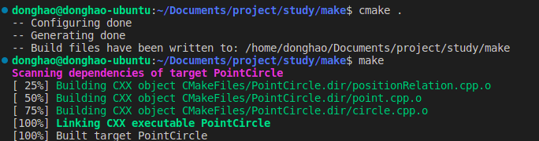
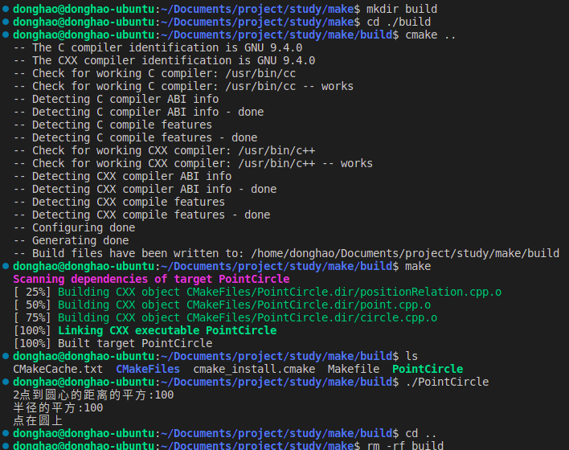

#Makefile
以本文件夹的几个cpp文件为例：
### 1.对于几个cpp文件最简单的编译可执行文件的方式是
终端执行
```
g++ positionRelation.cpp point.cpp circle.cpp -o main
```
生成的可执行文件main执行后就会运行代码
**但是每次修改cpp文件的内容后要重新运行上述代码进行编译。**


### 2.如果源文件特别多时，也可以单个编译生成.o文件，再对所有的.o文件进行链接生成可执行文件。
```
g++ positionRelation.cpp -c
g++ point.cpp -c
g++ circle.cpp -c
g++ *o -o main
```
这种编译对于修改了单个源文件的情况时可以只编译单个源文件生成.o文件再对所有.o文件编译生成可执行文件。
### 3.makefile编译
#### makefile version1：
(直接写在Makefile文件里即可)
```
## VERSION 1
main: positionRelation.cpp point.cpp circle.cpp
	g++ -o main positionRelation.cpp point.cpp circle.cpp
```
终端执行
```
make
```
会自动寻找并执行makefile文件
这里终端会显示执行：
```
g++ -o main positionRelation.cpp point.cpp circle.cpp
```
这个版本的缺点是如果有成千上百个源文件，每次更新都要全部重新编译，运行会很慢。（对.cpp操作是编译，对.o文件操作是链接）链接所需时间很短）
#### makefile version2：
```
## VERSION 2
CXX = g++
TARGET = main
OBJ = positionRelation.o point.o circle.o
$(TARGET): $(OBJ)               ##如果OBJ更新就会执行下面的编译。
	$(CXX) -o $(TARGET) $(OBJ)

positionRelation.o :positionRelation.cpp
	$(CXX) -c positionRelation.cpp

point.o: point.cpp
	$(CXX) -c point.cpp

circle.o: circle.cpp
	$(CXX) -c circle.cpp

```
终端执行
```
make
```
这里终端会自动显示执行：
```
g++ -c positionRelation.cpp
g++ -c point.cpp
g++ -c circle.cpp
g++ -o main positionRelation.o point.o circle.o  ##生成可执行文件
```


如果对某一个源文件进行修改再执行make，终端会显示执行：
```
g++ -c positionRelation.cpp
g++ -o main positionRelation.o point.o circle.o   ##生成可执行文件
```
**这种方法优点是只需要对修改的源文件进行编译，再对所有.o文件进行链接。**

#### makefile version3：
```
## VERSION 3
CXX = g++
TARGET = main
OBJ = positionRelation.o point.o circle.o

CXXFLAGS = -c -Wall

$(TARGET): $(OBJ)               ##如果OBJ更新就会执行下面的编译。
	$(CXX) -o $@ $^             

%.o : %.cpp
	$(CXX) $(CXXFLAGS) $< -o $@

.PHONY:clean
clean:
	rm -f *.o $(TARGET)
## $@表示的就是：前面的，$^表示：之后的依赖
## ^代表依赖里所有的 <代表依赖里的第一个
## .PHONY:clean 防止目录下有个名为clean的文件
## -Wall warn all全部警告
```
终端执行make clean会清空.o文件以及目标可执行文件
终端执行make会显示执行：
```
g++ -c -Wall positionRelation.cpp -o positionRelation.o
g++ -c -Wall point.cpp -o point.o
g++ -c -Wall circle.cpp -o circle.o
g++ -o main positionRelation.o point.o circle.o    ##生成可执行文件
```
**这种方法优点和VERSION2都是只需要对修改的源文件进行编译，再对所有.o文件进行链接。引用更多变量，为了VERSION4做铺垫**
#### makefile version4：
```
## VERSION 4
CXX = g++
TARGET = main
SRC = $(wildcard *.cpp)
OBJ = $(patsubst %.cpp, %.o, $(SRC))

CXXFLAGS = -c -Wall

$(TARGET): $(OBJ)               
	$(CXX) -o $@ $^             

%.o : %.cpp
	$(CXX) $(CXXFLAGS) $< -o $@

.PHONY:clean
clean:
	rm -f *.o $(TARGET)

```
1、wildcard : 扩展通配符
2、notdir ： 去除路径
3、patsubst ：替换通配符
一般我们可以使用“$(wildcard *.c)”来获取工作目录下的所有的.c文件列表


终端执行make后会显示并执行：
```
g++ -c -Wall positionRelation.cpp -o positionRelation.o
g++ -c -Wall point.cpp -o point.o
g++ -c -Wall circle.cpp -o circle.o
g++ -o main positionRelation.o point.o circle.o  
```
## CMakeLists
makefile在不同系统上会出现使用障碍，cmake解决了这个问题
CMakeList.txt是cmake程序要读的文件

跟上述一样用几个源文件生成一个可执行文件，写一个CMakeLists.txt文件如下：
```
cmake_minimum_required(VERSION 3.10)

project(PointCircle)

add_executable(PointCircle positionRelation.cpp point.cpp circle.cpp)
```

执行cmake会自动生成适合当前系统的makefile文件，**并生成一个CMakeFiles文件夹**，在用make执行makefile文件就可以生成可执行文件。

在一般的比较规范的项目编写中，一般不在源文件目录里直接用cmake编译，这样文件太乱不好清除，一般新建一个build文件夹，在build文件夹里进行编译，更加规范。操作如下图：
