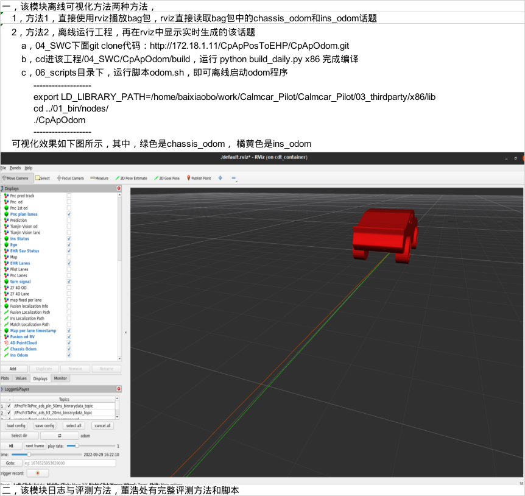
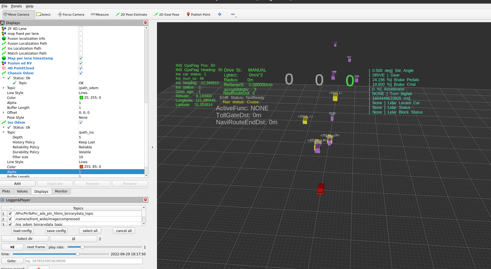
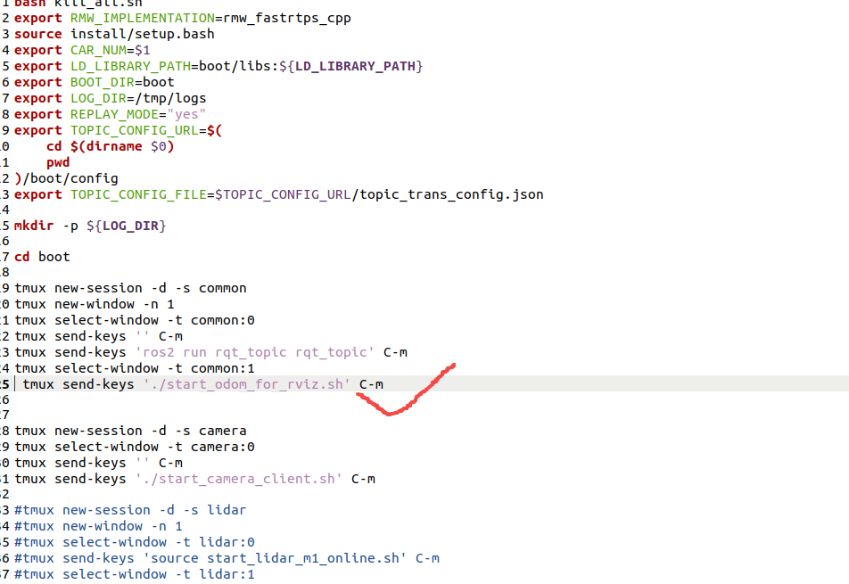
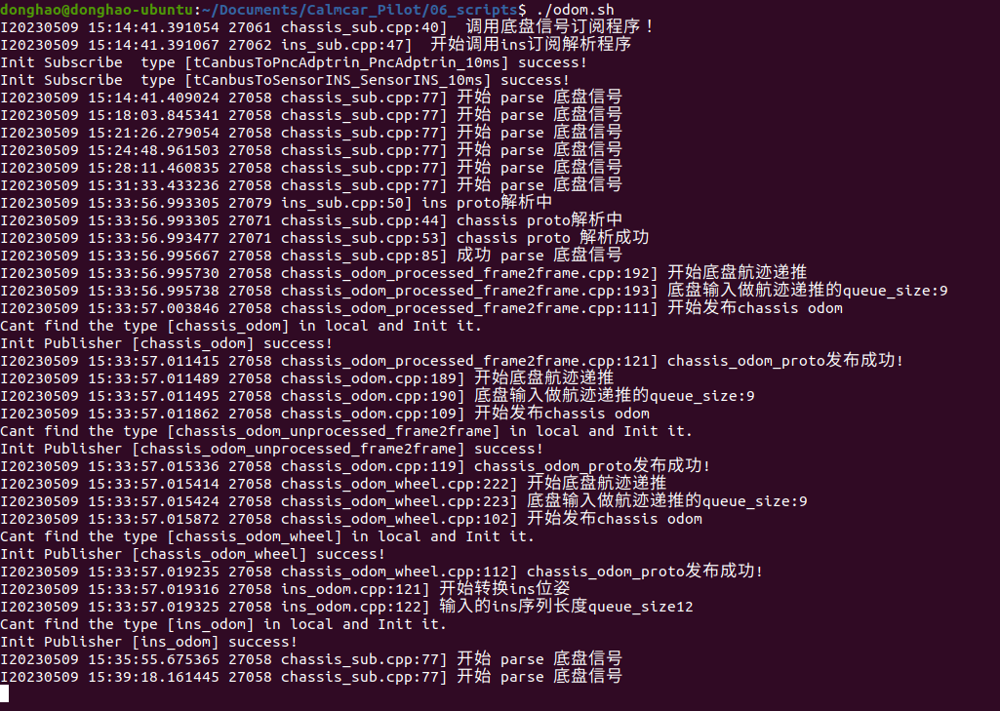
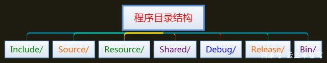
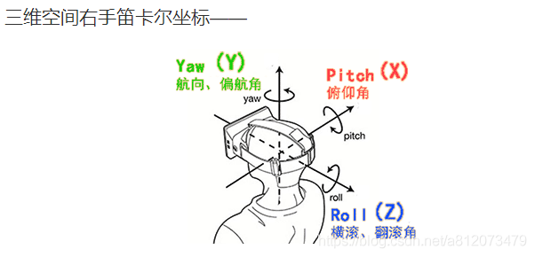
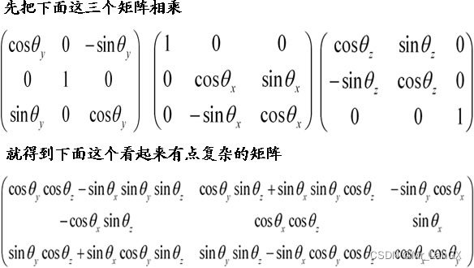
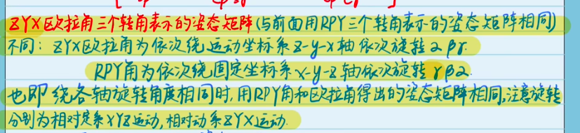
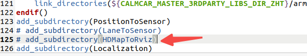
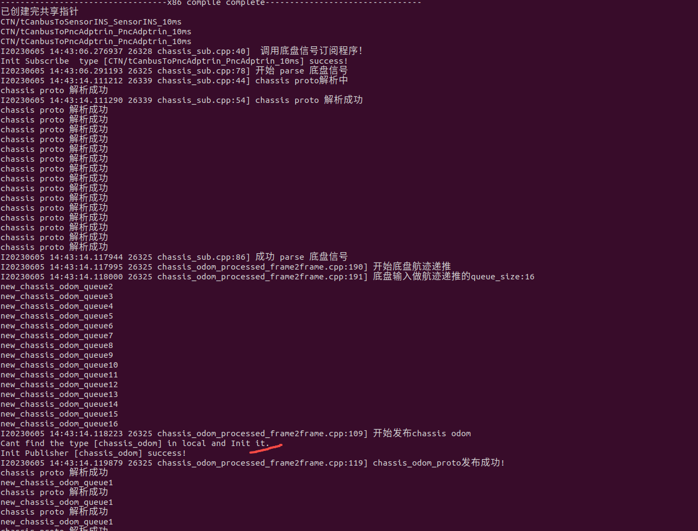

# 可视化
注意：现在生成的可执行文件CpApOdom已经改到Calmcar_Pilot/04_SWC/CpApOdom/01_bin/SWCS下，注意要把配置文件.yaml复制过去，在改动odom.sh的执行路径即可。

rviz里可视化的chassis_odom 接入的数据是 chassis_odom_binrarydata_topic

git clone http://172.18.1.11/CpApPosToEHP/CpApOdom.git
**按照方法1运行程序时**：没有路径线

此时需要修改tools里的boot_all_offline.sh或boot_all.sh，里面默认把odom注释掉了，取消注释即可，如下。

**按照方法2运行此程序时**：

# 接口

proto文件都在08_interfaces/proto文件夹下

## 程序文件的目录结构

1、Include目录下用于存放应用程序的头文件集合，也就是.h文件集合，在这个目录下面还可以根据需要划分子目录。

2、Source目录用于存放应用程序的源代码文件集合，也就是.c或者.cpp文件集合，在这个目录下也可以根据需要进行划分子目录。

3、Resource目录用于存放应用程序的一些资源文件，比如图片、视频、音频、对话框、图标以及光标等等，同样也可以划分几个子目录，便于管理。

4、Shared目录用于存放应用程序的一些共享文件。

5、Debug目录用于存放应用程序进行调试时的调试版本产生的中间文件。

6、Release目录用于存放应用程序进行发布时的发布版本产生的中间文件。

7、Bin目录用于存放程序猿自己创建的lib文件或dll文件。
————————————————
版权声明：本文为CSDN博主「_大峰_」的原创文章，遵循CC 4.0 BY-SA版权协议，转载请附上原文出处链接及本声明。
原文链接：https://blog.csdn.net/weixin_43336281/article/details/100105758

## RPY角和欧拉角
### pitch、yaw、roll三个角的区别

“欧拉角是用来唯一地确定定点转动刚体位置的三个一组独立角参量，由章动角θ、进动角ψ和自转角φ组成，为L.欧拉首先提出，故得名。它们有多种取法，下面是常见的一种”

三个角分别是Yaw,Pitch,Roll。可以这样简单的理解：Yaw 表示绕Z轴的偏航角度，Pitch表示绕X轴旋转的俯仰角度，Roll表示绕Y轴旋转的纵向翻滚角度。也就是说，任意的旋转角度都可以通过这三次按照先后顺序旋转得到。矩阵很难让人具体形象表示，欧拉角就容易多了。注意可能很多地方三个角的先后次序不一样

我们知道可以先把这三个矩阵相乘，这样可以节约计算量。就是要先计算这三个矩阵相乘，注意矩阵相乘次序是不可更改的，更改了结果就不一样了。欧拉角的三个角，可以转变为矩阵与矩阵的相乘。
已知pyr求旋转矩阵：由三个基本旋转矩阵从右到左依次相乘得到旋转矩阵。

已知旋转矩阵求pyr。
反正切函数求
### 欧拉角

cpapodom      白
cpapinstoehr 白
cpaplocation... 江
三个

在自己电脑编译arm 上传arm版本
**可执行程序 configure配置文件 放到一个文件夹里压缩一下zip**
curl - （zip） http：。。。。piolt/ （zip）
写个txt说明文件  
20230519改动了CpApPosToEHP中的CMakeLists中的HDMapToRviz的编译

odom航迹推算 刚体运动 等等 基础知识

侯杰的c++书籍 快速浏览
国产int8做量化 nvidia fp32

**在本地进行播放topic包来运行odom程序时，需要播放的两个topic要打全名**，比如（ros2 bag play rosbag2_2023_03_28-16_26_43_4.db3 --topics /CTN/tCanbusToPncAdptrin_PncAdptrin_10ms_binrarydata_topic /CTN/tCanbusToSensorINS_SensorINS_10ms_binrarydata_topic），
**而配置文件里topic要改成**
chassis_topic: CTN/tCanbusToPncAdptrin_PncAdptrin_10ms
ins_topic: CTN/tCanbusToSensorINS_SensorINS_10ms
用rqt指令可以查看topic播放的帧率等情况。

RPY（固定轴旋转）：先旋转的放在右边，后旋转的放在左边，（矩阵的乘积不具有互换性）

欧拉角：先旋转的放左边（和RPY固定轴旋转刚好相反）

向量可以平移，但不能随意旋转，旋转后向量方向就发生变化了，就不是原来的向量了。

旋转矩阵 第一列 010，如果不旋转则是100，所以这里是newx轴 = oldy轴，第二列第三列同理。

旋转矩阵和齐次变换矩阵都是正交矩阵

齐次变换除了直接求逆还能间接利用变换关系求逆（如下：）

齐次变换矩阵表示一个坐标系与另一个坐标系既有旋转又有平移的变换关系。

ins

y = y ;x = -x

y = -y; x = x

y= x;x =-y(白工代码是这样的转换的）z向更小。