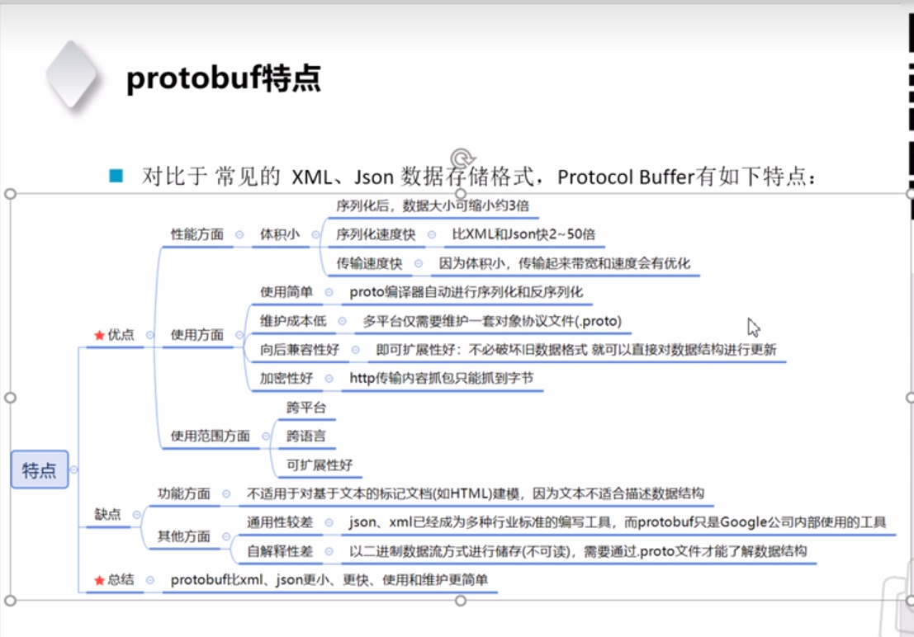
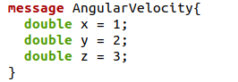

https://www.bilibili.com/video/BV1wp4y197sQ/?spm_id_from=333.337.search-card.all.click&vd_source=d7bcde14a5aba250f0f145435d887db0

protobuf后台开发使用较多
主要用来序列化和反序列化
protobuf序列化后体积小，序列化速度快，传输速度快，可跨平台。
(序列化是把对象变成字符串，反序列化是再变成原来的对象)

向后兼容性好，可直接在后面添加。例如下面这个结构体可以直接在后面添加。。。=4；：

