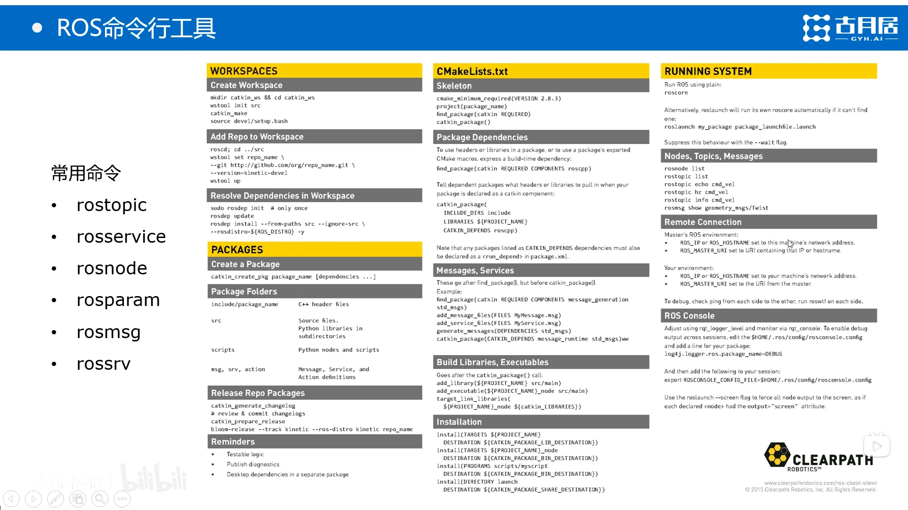
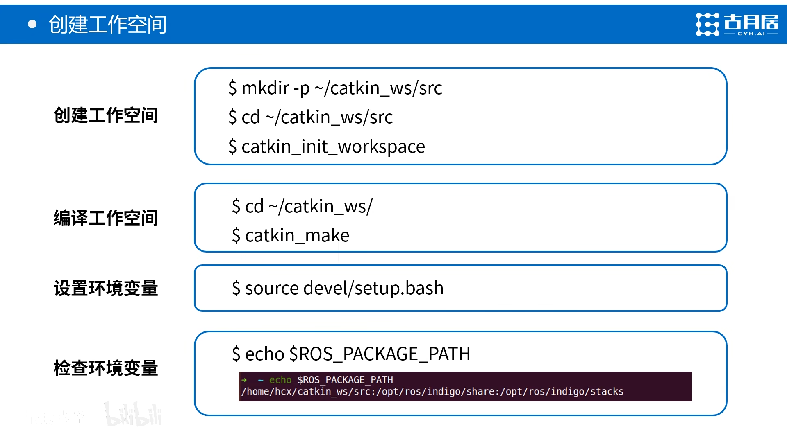

---
html:
  toc: true
---
# ROS:RoBot Operating system
鱼香ros一键安装
```
wget http://fishros.com/install -O fishros && . fishros 
```
安装两个ros版本时每次启动终端都要选择。
这里可以把这几行全注释掉，把（2）的source复制一行。就不用每次选择了。但是要使用到另一个版本就要手动改了。


安装g++是c++的编译环境
编译器、解析器（Python是解析器），C++运行需要先编译再解析

**source**是ubuntu里运行脚本的指令。

“echo >”和“echo >>”的区别
**\> 输出重定向
\>> 输出追加重定向**
echo hello A
将字符串hello A输出到屏幕

echo hello A > tmp.txt
将字符串输出重定向，当前目录没有tmp.txt，则创建tmp.txt，并将字符串输出到tmp.txt文件中
tmp.txt内容：hello A

echo hello B > tmp.txt
将字符串输出重定向， 当前目录存在tmp.txt，则将tmp.txt内容替换成输出的字符串
tmp.txt内容：hello B

echo hello C >> tmp.txt
将字符串输出追加重定向，当前目录存在tmp.txt，则将tmp.txt的内容后面追加输出的字符串
tmp.txt内容：hello B hello C
**验证ros是否安装成功**
```
roscore
```
新终端输入
```
rosrun turtlesim turtlesim_node
```
```
rosrun turtlesim turtle_teleop_key
```
上述代码显示效果如下：

**ROS是什么**

**ROS通讯机制**

**ROS的开发工具**

**ROS的应用功能**

## 节点与节点节点管理器
ROS Master会记录全局变量 方便节点去访问


## 话题通信

## 服务通信

**话题多用于单向传输，不需要回应的**

## 参数

## 文件系统

## ROS命令行工具

# ROS命令行工具的使用
## **小海龟运行机制**：
（注意下面每行代码都要开启新终端运行）
```
roscore
```
```
rosrun turtlesim turtlesim_node
```
rosrun +功能包 +节点
```
bag
```
rosrun +功能包+节点
## **查看节点情况**
```
rqt_graph
```

上图可以看到一个topic和两个节点
## **查看目前系统所有节点**
```
rosnode list
```
查看节点上的详细信息
```
rosnode info  （节点名,从rqt_graph中查看）
```
## **查看所有话题**
```
rostopic list
```

在topic上发布话题（输入话题名然后按table补全）：
geometry_msgs 是话题结构（ros里面默认单位为m/s）
```
rostopic pub /turtle1/cmd_vel geometry_msgs/Twist "linear:
  x: 1.0 
  y: 0.0
  z: 0.0
angular:
  x: 0.0
  y: 0.0
  z: 0.0" 
publishing and latching message. Press ctrl-C to terminate
```
修改上面的linear x:1.0 可以看到小乌龟移动1m
要想让小乌龟一直移动，则需要一个循环，改动上述代码为
```
rostopic pub -r 10 /turtle1/cmd_vel geometry_msgs/Twist "linear:
  x: 1.0 
  y: 0.0
  z: 0.0
angular:
  x: 0.0
  y: 0.0
  z: 0.0" 
publishing and latching message. Press ctrl-C to terminate
```
-r 10 代表以10hz循环 （运行一会小乌龟就会撞墙到达边界，这时候终端也会有提醒），angular是改变角速度的，也可以试试。

## 查看消息
rosmsg show指令可查看话题消息的结构
```
donghao@donghao-ubuntu:~$ rosmsg show geometry_msgs/Twist
geometry_msgs/Vector3 linear
  float64 x
  float64 y
  float64 z
geometry_msgs/Vector3 angular
  float64 x
  float64 y
  float64 z
  ```
## 查看服务
rosservice的使用，其中list中spawn是产生的意思
```
donghao@donghao-ubuntu:~$ rosservice list
/clear
/kill
/reset
/rosout/get_loggers
/rosout/set_logger_level
/rqt_gui_py_node_11720/get_loggers
/rqt_gui_py_node_11720/set_logger_level
/spawn
/teleop_turtle/get_loggers
/teleop_turtle/set_logger_level
/turtle1/set_pen
/turtle1/teleport_absolute
/turtle1/teleport_relative
/turtlesim/get_loggers
/turtlesim/set_logger_level
```
这里使用rosservice中的/spawn来产生第二只海龟，输入/spawn后两下table键补全，更改xy和theta可改变小海龟初始位置和角度，如下图
```
donghao@donghao-ubuntu:~$ rosservice call /spawn "x: 1.0
y: 1.0
theta: 0.0
name: 'turtle2'" 
name: "turtle2"
```


这个时候在输入rostopic list可以查看到第二只海龟了
```
donghao@donghao-ubuntu:~$ rostopic list
/rosout
/rosout_agg
/statistics
/turtle1/cmd_vel
/turtle1/color_sensor
/turtle1/pose
/turtle2/cmd_vel
/turtle2/color_sensor
/turtle2/pose
```
可以根据指令对第二只海龟进行操控
## 话题记录
```
rosbag record -a -O cmd_record
```
a代表all所有数据，大写的o，cmd_record是命名。例如输入下面代码开始记录，ctrl+c结束录制，数据会自动保存到根目录。
```
donghao@donghao-ubuntu:~$ rosbag record -a -O cmd_record 
[ INFO] [1682215244.357749738]: Recording to 'cmd_record.bag'.
[ INFO] [1682215244.358550379]: Subscribing to /rosout_agg
[ INFO] [1682215244.359516715]: Subscribing to /rosout
[ INFO] [1682215244.360345391]: Subscribing to /turtle1/pose
[ INFO] [1682215244.361068372]: Subscribing to /turtle1/color_sensor
[ INFO] [1682215244.361766296]: Subscribing to /turtle1/cmd_vel
```
## 话题复现
这里用到上面录制的rosbag包
这里关闭所有终端，重新先起两个终端运行roscore，rosrun turtlesim_node
```
rosbag play cmd_record #(这里cmd_record在根目录，如果在其他地方需要更改路径)
```
运行rosbag play命令后小乌龟的运动状态就会按照之前录制的rosbag包进行复现
**需要注意的是上述指令为常见指令，有很多参数需要自己尝试。**
# 创建工作区间与功能包

安装空间一般用不到

创建工作空间中初始化工作空间很重要，初始化后cakin_ws下会生成cmakelists.txt文件
# 编译工作空间
可能会出错：错误代码： 
The specified base path “/home/ubuntu/catkin_ws” contains a CMakeLists.txt but “catkin_make” must be invoked in the root of workspace…..

出现这种情况的原因是catkin_init_workspacce的时候，出现下面这句： 
Creating symlink “/home/ubuntu/catkin_ws/CMakeLists.txt” pointing to “/opt/ros/indigo/share/catkin/cmake/toplevel.cmake”
将当前工作空间下的CMakeLists.txt与/ros/下的cmake做了链接

解决方法： 
```unlink /home/ubuntu/catkin_ws/CMakeLists.txt ```

这里没有生成install文件夹，要生成install文件夹，输入
```catkin_make install```
**设置环境变量放到运行setup.bash之后**
## 创建功能包

```
donghao@donghao-ubuntu:~/Documents/cakin_ws/src$ catkin_create_pkg test_pkg std_msgs rospy roscpp
Created file test_pkg/package.xml
Created file test_pkg/CMakeLists.txt
Created folder test_pkg/include/test_pkg
Created folder test_pkg/src
Successfully created files in /home/donghao/Documents/cakin_ws/src/test_pkg. Please adjust the values in package.xml.
```
上述代码中test_pkg 为功能包名 后面跟的是所需要的依赖
```bash
source devel/setup.bash
```
上面这一步是对catkin_ws空间的环境变量进行设置
```bash
donghao@donghao-ubuntu:~/Documents/cakin_ws$ echo $ROS_PACKAGE_PATH
/home/donghao/Documents/cakin_ws/src:/opt/ros/noetic/share
```
## 功能包中的两个重要文件
**package.xml**

使用xml语言描述功能包相关的信息：
（后面的课会用到）


**CMakeLists.txt**

描述功能包里的编译规则，使用CMake语法。
（后面的课会越来越多的用到）

# 发布者Publisher的编程实现
## 话题模型

**先创建一个功能包**
```bash
donghao@donghao-ubuntu:~/Documents/cakin_ws/src$ catkin_create_pkg learning_topic roscpp rospy std_msgs
Created file learning_topic/package.xml
Created file learning_topic/CMakeLists.txt
Created folder learning_topic/include/learning_topic
Created folder learning_topic/src
Successfully created files in /home/donghao/Documents/cakin_ws/src/learning_topic. Please adjust the values in package.xml.
```

这里直接把学习代码/home/donghao/Documents/ros_21_tutorials-master/learning_topic/src/下面的Vecloity。。。copy到learning_topic/src下
代码如下：
 ```c
#include <ros/ros.h>    
#include <geometry_msgs/Twist.h>

int main(int argc, char **argv)
{
	// ROS节点初始化,"velocity_publisher"是节点名字
	ros::init(argc, argv, "velocity_publisher");

	// 创建节点句柄，句柄用来管理ros的api资源，管理节点的资源
	ros::NodeHandle n;

	// 创建一个Publisher，发布名为/turtle1/cmd_vel的topic，
  //尖括号里面放的是消息类型，这里为geometry_msgs::Twist
  //后面()里面是要发布的topic名，队列长度10，先把数据放到队列再依次发布，防止网络等问题导致生成了但发不出去
  //队列如果还是跟不上发布 会把时间戳较老的数据依次剔除，这时候就会产生掉帧等情况
	ros::Publisher turtle_vel_pub = n.advertise<geometry_msgs::Twist>("/turtle1/cmd_vel", 10);

	// 设置循环的频率
	ros::Rate loop_rate(10);

	int count = 0;
	while (ros::ok())
	{
	    // 初始化geometry_msgs::Twist类型的消息
		geometry_msgs::Twist vel_msg;
		vel_msg.linear.x = 0.5;
		vel_msg.angular.z = 0.2;

	    // 发布消息
		turtle_vel_pub.publish(vel_msg);
		ROS_INFO("Publsh turtle velocity command[%0.2f m/s, %0.2f rad/s]", 
				vel_msg.linear.x, vel_msg.angular.z);

	    // 按照循环频率延时
	    loop_rate.sleep();
	}

	return 0;
}
 ```
## 配置发布者代码编译规则

将下列代码拷贝至CMakeLists.txt中：
 ```cpp
add_executable(velocity_publisher src/velocity_publisher.cpp)
target_link_libraries(velocity_publisher ${catkin_LIBRARIES})
 ```


## 编译并运行发布者
**步骤如下图**

其中
source 一下 setup.bash
我们之后每次运行这个程序都需要source一下devel/setup.bash，我们不妨将
source devel/setup.bash放入环境变量.bashrc中。（.bashec在根目录里，ctrl+
h隐藏或显示）

命令行：
 ```
rosrun learning_topic velocity_publisher 
 ```
learning_topic 视功能包 velocity_publisher是节点名
运行之后小乌龟会按照节点代码运行，沿着圆圈一直走

**可以看到在lib/learning_topic/下生成了一个节点的可执行文件**

# 订阅者Subscriber的编程实现


代码如下：
```cpp
/**
 * 该例程将订阅/turtle1/pose话题，消息类型turtlesim::Pose
 */
 
#include <ros/ros.h>
#include "turtlesim/Pose.h"

// 接收到订阅的消息后，会进入消息回调函数 ConstPtr是长指针
void poseCallback(const turtlesim::Pose::ConstPtr& msg)
{
    // 将接收到的消息打印出来
    ROS_INFO("Turtle pose: x:%0.6f, y:%0.6f", msg->x, msg->y);
}

int main(int argc, char **argv)
{
    // 初始化ROS节点
    ros::init(argc, argv, "pose_subscriber");

    // 创建节点句柄
    ros::NodeHandle n;

    // 创建一个Subscriber，订阅名为/turtle1/pose的topic，注册回调函数poseCallback
    ros::Subscriber pose_sub = n.subscribe("/turtle1/pose", 10, poseCallback);

    // 循环等待回调函数(订阅者一旦发现队列里有消息进来就调用回调函数)
    ros::spin();

    return 0;
}
```
## 配置订阅者代码编译规则

将下列代码拷贝至src/learning_topic/CMakeLists.txt中：
直接加到之前那两行下面即可
```
add_executable(pose_subscriber src/pose_subscriber.cpp)
target_link_libraries(pose_subscriber ${catkin_LIBRARIES})
 ```

## 编译并运行订阅者
c++每次运行都要先编译

键盘输入或者直接运行上一节的velocity_publisher 可以看到订阅者会在终端不断更新小海龟的位置信息
# 话题消息的定义与使用


 **第一步定义msg文件**
在learning_topic下创建msg文件夹(跟消息相关的定义都放到这个文件夹里方便管理），创建Person.msg文件，把话题消息string name
uint8 sex
。。。
复制进Person.msg文件里。（完成数据接口的定义）
**第二步添加功能包依赖**
在learning_topic下的package.xml中添加
```
<build_depend>message_generation</build_depend>
<exec_depend>message_runtime</exec_depend>
```
如下图：

**第三步添加编译选项**
在CMakeLists.txt中添加编译选项

1. 因为在package.xml添加了功能包编译依赖，在CMakeList.txt里的find_package中也要加上对应的部分；
2. 需要将定义的Person.msg作为消息接口，针对它做编译；需要指明编译这个消息接口需要哪些ROS已有的包；
3. 有了这两个配置才可将定义的msg编译成不同的程序文件
4. 因为在package.xml添加了功能包执行依赖，在CMakeList.txt里的catkin_package中也要加上对应的部分；

代码，复制到图示位置：
```
find_package( ...... message_generation)

add_message_files(FILES Person.msg)
generate_messages(DEPENDENCIES std_msgs)

catkin_package( ...... message_runtime)
```


**第四步编译**
回到cakin_ws目录
```
catkin_make
```
编译完成后，我们可以在 devel/include/learning_topic/ 下找到这个C++的头文件：

## 创建代码并编译运行（C++）
我们创建一个Publisher代码和一个Subscriber代码，通过程序调用生成的.h。
(源码：https://github.com/guyuehome/ros_21_tutorials/tree/master/learning_topic/src)
将代码拷贝到learning_topic/src文件夹下。
**发布者**
```cpp
/**
 * 该例程将发布/person_info话题，自定义消息类型learning_topic::Person
 */

#include <ros/ros.h>
#include "learning_topic/Person.h" //调用自己编译的头文件

int main(int argc, char **argv)
{
    // ROS节点初始化
    ros::init(argc, argv, "person_publisher");

    // 创建节点句柄
    ros::NodeHandle n;

    // 创建一个Publisher，发布名为/person_info的topic，消息类型为learning_topic::Person，队列长度10
    ros::Publisher person_info_pub = n.advertise<learning_topic::Person>("/person_info", 10);

    // 设置循环的频率
    ros::Rate loop_rate(1);

    int count = 0;
    while (ros::ok())
    {
        // 初始化learning_topic::Person类型的消息
        learning_topic::Person person_msg;
                person_msg.name = "Tom";
                person_msg.age  = 18;
                person_msg.sex  = learning_topic::Person::male;

        // 发布消息
                person_info_pub.publish(person_msg);

        ROS_INFO("Publish Person Info: name:%s  age:%d  sex:%d",
                                  person_msg.name.c_str(), person_msg.age, person_msg.sex);

        // 按照循环频率延时
        loop_rate.sleep();
    }

    return 0;
}
```
**订阅者**
```cpp
/**
 * 该例程将订阅/person_info话题，自定义消息类型learning_topic::Person
 */

#include <ros/ros.h>
#include "learning_topic/Person.h"

// 接收到订阅的消息后，会进入消息回调函数
void personInfoCallback(const learning_topic::Person::ConstPtr& msg)
{
    // 将接收到的消息打印出来
    ROS_INFO("Subcribe Person Info: name:%s  age:%d  sex:%d",
                         msg->name.c_str(), msg->age, msg->sex);
}

int main(int argc, char **argv)
{
    // 初始化ROS节点
    ros::init(argc, argv, "person_subscriber");

    // 创建节点句柄
    ros::NodeHandle n;

    // 创建一个Subscriber，订阅名为/person_info的topic，注册回调函数personInfoCallback
    ros::Subscriber person_info_sub = n.subscribe("/person_info", 10, personInfoCallback);

    // 循环等待回调函数
    ros::spin();

    return 0;
}
```
**编译**

先配置CMakeLists.txt编译规则，复习一下规则：

    设置需要编译的代码和生成的可执行文件；
    设置链接库；
    添加依赖项。

将下面代码拷贝到指定位置：
```
add_executable(person_publisher src/person_publisher.cpp)
target_link_libraries(person_publisher ${catkin_LIBRARIES})
add_dependencies(person_publisher ${PROJECT_NAME}_generate_messages_cpp)

add_executable(person_subscriber src/person_subscriber.cpp)
target_link_libraries(person_subscriber ${catkin_LIBRARIES})
add_dependencies(person_subscriber ${PROJECT_NAME}_generate_messages_cpp)

```
这里新增了一个添加依赖项，因为代码涉及到动态生成，我们需要将可执行文件与动态生成的程序产生依赖关系。

然后编译
```
cd ~/catkin_ws
catkin_make
```
**运行**

默认已经source，接着运行
```
roscore
```
```
rosrun learning_topic person_publisher
```
```
rosrun learning_topic person_subscriber
```
可以看到运行成功，subscriber接收到了publisher的person信息：


**如果我们将roscore关掉，可以看到subscriber和publisher依然在接发.**
roscore代表了ROS Master，它帮助subscriber和publisher建立通信连接，连接建立后退出舞台也没什么问题了。
但是关闭ROS Master就不能管理这个连接了。同时也无法看到rqt_graph。
# 参数的使用与编程方法
## 概念图
在ROS Master中，存在一个参数服务器（Parameter Server），它是一个全局字典，即一个全局变量的存储空间，用来保存各个节点的配置参数。各个节点都可以对参数进行全局访问。

## 创建功能包
本节建立一个新的功能包，命名为 learning_parameter。在src下创建。
```
cd ~/catkin_ws/src
catkin_create_pkg learning_parameter roscpp rospy std_srvs
```
## 参数命令行的使用(rosparam)

rosparam命令可以完成参数相关的大部分功能。

在ROS中，参数文件常以YAML文件的格式保存，形式如下：

常用 rosparam 命令用法：

我们打开海龟仿真节点来试一下。
```
roscore
```
```
rosrun turtlesim turtlesim_node
```
**显示参数列表**
```
rosparam list
```

观察一下这些参数，可以看到：
/turtlesim/background_b
/turtlesim/background_g
/turtlesim/background_r
分别代表了小海龟的背景RGB颜色，目前是蓝色。
/rosdistro 为ros的版本代号
/roslaunch/uris/host_ck_vpc__35381
/rosversion 当前ros的版本
/run_id 进程的id号
**显示某个参数值**
例：
```
rosparam get /turtlesim/background_b
```

**设定某个参数值**
例：
```
rosparam set /turtlesim/background_b 100
```

把/turtlesim/background_b的值改成100，再get一下可以看到已经改成了255

但是，海龟的背景颜色还没变。我们需要发送一个clear的空内容服务请求：
```
rosservice call /clear "{}"
```

可以看到背景以及改过来了。

**保存参数到文件**
例：
```
rosparam dump param.yaml
```

将参数导出，保存为param.yaml文件。
默认保存位置为当前工作空间根目录下（其实是功能包下面），我们可以打开看看：

**从文件读取参数**

我们可以直接在这个yaml文件里修改参数，然后导回去。
比如背景色改成 255，255，255（白色）
导回去：
```
rosparam load param.yaml
```


## 使用程序来使用参数（C++）

这次我们使用程序来获取和设置参数。
如何获取/设置参数：

    get函数获取参数
    set函数设置参数
**创建代码**
（源码：https://github.com/guyuehome/ros_21_tutorials/tree/master/learning_parameter/src）
在这里插入图片描述
```cpp
/**
 * 该例程设置/读取海龟例程中的参数
 */
#include <string>
#include <ros/ros.h>
#include <std_srvs/Empty.h>

int main(int argc, char **argv)
{
        int red, green, blue;

    // ROS节点初始化
    ros::init(argc, argv, "parameter_config");

    // 创建节点句柄
    ros::NodeHandle node;

    // 读取背景颜色参数
        ros::param::get("/background_r", red); //get函数获取参数
        ros::param::get("/background_g", green);
        ros::param::get("/background_b", blue);

        ROS_INFO("Get Backgroud Color[%d, %d, %d]", red, green, blue);

        // 设置背景颜色参数
        ros::param::set("/turtlesim/background_r", 255);//set函数设置参数
        ros::param::set("/turtlesim//background_g", 255);
        ros::param::set("/turtlesim//background_b", 255);

        ROS_INFO("Set Backgroud Color[255, 255, 255]");

    // 读取背景颜色参数
        ros::param::get("/turtlesim//background_r", red);
        ros::param::get("/turtlesim//background_g", green);
        ros::param::get("/turtlesim//background_b", blue);

        ROS_INFO("Re-get Backgroud Color[%d, %d, %d]", red, green, blue);

        // 调用服务，刷新背景颜色
        ros::service::waitForService("/clear");//调用/clear服务来刷新背景色
        ros::ServiceClient clear_background = node.serviceClient<std_srvs::Empty>("/clear");//发送空内容的/clear服务
        std_srvs::Empty srv;
        clear_background.call(srv);//阻塞函数，调用空服务数据

        sleep(1);

    return 0;
}
```
注意这段代码需要修改一下以满足我们当前Noetic版本ROS的要求，背景色的三个参数名前面都要带 /turtlesim，因为Noetic中背景色的参数名称就是这样。修改：

完成后将代码拷贝到src文件夹下。
**编译**

先配置CMakeLists.txt编译规则，规则：

    设置需要编译的代码和生成的可执行文件；
    设置链接库

将下面代码拷贝到指定位置：
然后编译：
```
cd ~/catkin_ws
catkin_make
```
**运行**

默认已经source，接着运行。
```
roscore
```
```
rosrun turtlesim turtlesim_node
```
```
rosrun learning_parameter parameter_config
```
可以看到背景从蓝色变成了白色。

# launch启动文件的使用方法
在之前的学习中，比如上一讲TF坐标广播和监听，启动程序非常麻烦，一共启动了6个终端窗口，并且涉及到终端向ROS的参数传递。launch启动文件将解决这个问题，帮助我们快速部署、整合并启动程序。

## launch文件结构
1. 由XML语言写的，可实现多个节点的配置和启动。
2. 不再需要打开多个终端用多个rosrun命令来启动不同的节点了
3. 可自动启动ROS Master

## launch文件语法
**根元素**

注：name为节点名称，会取代程序中初始化节点 init 时赋予的名字。

## 发布者
```cpp
 cloud_pub = nh.advertise<sensor_msgs::PointCloud2>(local_cloud_topic, 1);
 ```
 中括号里的是**消息数据结构**，小括号里的是**话题名**和**队列长度**
 ## 设置循环频率
 ```
 ros::Rate loop_rate(200);
 ```
 ```cpp
     while (ros::ok() && status < calib_num)
    {
        loop_rate.sleep();        //按照循环频率延时
        ros::spinOnce();
    }
```
**每次调用ros::spinOnce()都会执行与消息队列中缓存的信息数量相同次数的回调函数，只要回调函数执行够快的话，就能清空队列**
