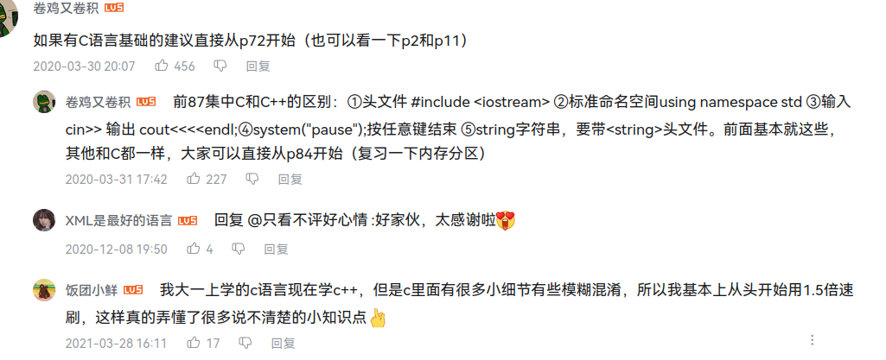

endl表示以换行结束 可以写成"\t"代表以制表符结束 或者以" "结束设置成空格结束
Int8, 等于Byte, 占1个字节.

　   Int16, 等于short, 占2个字节. -32768 32767

　   Int32, 等于int, 占4个字节. -2147483648 2147483647

　   Int64, 等于long, 占8个字节. -9223372036854775808 9223372036854775807