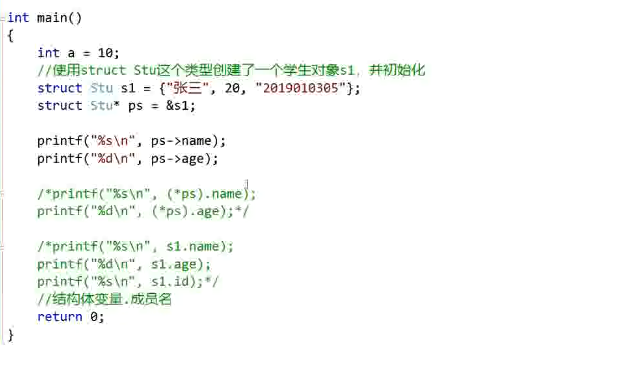
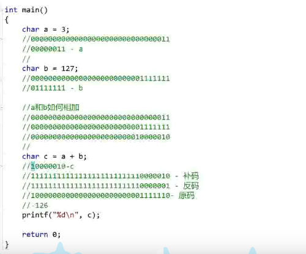
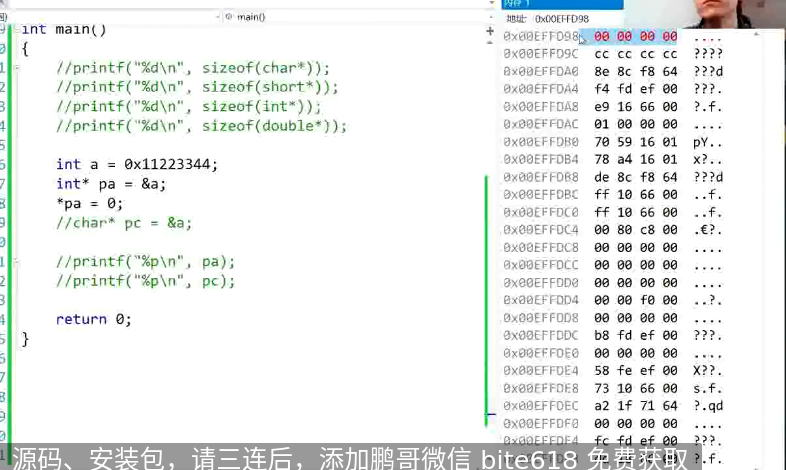
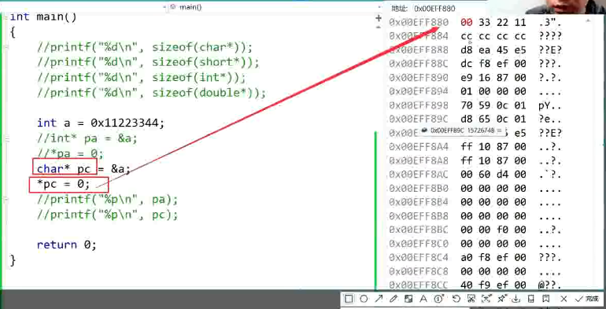
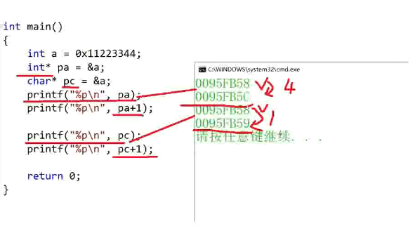

# 初识C语言(还没看p9,p18)

## 创建工程（新建项目）

.c - 源文件

.h - 头文件


## 写代码
```c
#include <stdio.h> //后续使用任何既成函数都必须要有这个

int main() //主函数-程序的入口（main函数有且仅有一个）int表示返回整形
{

	//这里完成任务，比如使用printf打印函数，printf是库函数，使用库函数要提出包含库函数#include<studio.h>，std-标准 standard input output

	return 0; //返回

}
```
---

### 数据类型

char //字符类型 占1个byte

short //短整型 占2个byte

int //整型 占4个byte

long //长整型 占4个byte（也可以是8个）

c语言标准规定 sizeof(long) >= sizeof(int)即可 （sizeof单位是字节）

long long //更长的整形 占8个byte

float //单精度浮点数 4byte

double //双精度浮点数 8byte

这里比如 age 一般是不大的整数 用 short age =20；比int更省空间 运算更快
```c
#include <stdio.h>


int main()

{

	char ch = 'A'; //内存

	printf("%c\n", ch); //%c -- 打印字符格式的数据

	char age = 20; 

	printf("%d\n", age); //%d --打印整数格式的数据

	float f = 5.0;

	printf("%f\n", f); //%f -- 打印浮点格式的数据

	double d = 3.14;

	printf("%lf\n", d); //%lf -- 打印长浮点格式的数据

	

	printf("%d\n", sizeof(int)); // 打印整形的储存空间

	printf("%d\n", sizeof(long long)); // 打印更长的整形的存储空间（字节））

	return 0;

}
```

---

## 计算机中的单位 

bit - 比特位 byte - 字节 kb mb gb tb pb

计算机是硬件 -- 通电 正电1 负电0

比特位只能存放1，0 一个比特位能储存一个1或一个0

一个byte（字节）等于8个bit位的大小 一个byte可以储存2^8种数据，两个字节可以储存2^16种数据（0-65535）

一个kb是1024个byte 一个mb是1024个kb 一个gb是1024个kb 。。。。

十进制 123 = 1*100^1 + 2*10^1 + 3*1^1

十进制的123转换为二进制是 2^6 + 2^5 + 2^4 + 2^3 + 2^1 +2^0 = 1111011

## 变量、常量
```c

#include <stdio.h>


int a = 20; // 全局变量-定义在代码块{}之外的变量

int main()

{

	int a = 10; // 局部变量- 定义在代码代码块{}内部

	// 局部变量和全局变量的名字建议不要相同，容易误会产生bug，当局部变量和全局变量的名字相同时，局部变量有限打印

	printf("%d\n", a);

	return 0;

}
```

**变量的使用**
```c

#include <stdio.h>


int main()

{

 	int num1 = 0;

 	int num2 = 0;

 	//输入数据-使用输入函数scanf

	scanf("%d%d",&num1, &num2); 

	//取地址符号&，相当于把输入的数字放到num1，mun2之前所申请的地址里

	int sum = 0; //这里有时会报错，C语言规定-变量要定义在代码快的最前面

	sum = num1 + num2;

	printf("sum = %d\n", sum);

	return 0;

}
```
**变量的作用域和生命周期**

局部变量的作用域是所在局部区域，全局变量的作用域使整个工程（包括不同代码源文件，只需要在需要使用的代码中extern 声明即可）。

局部变量生命周期是进入作用域到出作用域，全局变量的生命周期是整个程序的生命周期。
```c
#define .... （放在include <stdio.h>前面，可以去除一些警告等等）
```

**常量**

3，4，5...字面常量

**const定义的常属性变量**
```c

#include <stdio.h>


int main()

{ //const - 常属性

 const int num = 6; // num是变量，但是又有常属性，所以num是常属性变量

 printf("%d\n", num);

 // num = 8; //会报错，因此num有常属性，不能变

 //int arr[num] = {0}; //这里也会报错，因此数组的大小需要是常量

 return 0;

}
```

**define 定义的标识符常量**
```c
#include <stdio.h>
//#define 定义的标识符常量
#define MAX 10

int main()

{ 

	int arr[MAX] = {0};

	printf("%d\n", MAX);

	return 0;

}
```

**枚举常量 （枚举 - 一一列举）**
//三原色： 红、黄、蓝

//星期： 1，2，3，4，5，6，7

枚举关键 -enum
```c

#include <stdio.h>


enum Sex
{

	MALE,

	FEMALE,

	SECRET

};


int main()

{ 

	printf("%d\n", MALE); //0

	printf("%d\n", FEMALE); //1

	printf("%d\n",SECRET); //2 枚举常量不能改，比如SECRET = 2，这里是个常量。 

	return 0;

}
```

## 字符串

双引号引起的一串字符就成为字符串
作判断时比如 if x == '*';一定要用单引号，单引号括起来的会被转换成ASCII值进行判断。

\0是字符串的结束标志
```c

#include <stdio.h>


int main()

{ 
	char arr1[] = "abc"; //数组，注意字符串数组求长度时留意转义字符

	//"abc" --'a','b','c','\0' --'\0'是字符串的结束标志

	char arr2[] ={'a', 'b', 'c', 0}; //如果主动在要打印的字符串后放‘\0’或0就可以结束字符串，如果没有打印出来会乱码

	char arr3[] = {'a', 'b', 'c'};

	// ‘\0’ -- 0， 'a' -- 97 'A' -- 65 ASCII编码 字符的值是ASCII码值（数据在计算机上储存的是2进制）

	printf("%s\n", arr1); //%s表示打印字符串

	printf("%s\n", arr2);

	printf("%d\n", strlen(arr3)); //strlen() --计算字符串长度的函数 

	//这个打印的数未知，字符串会从a开始一直找到\0出现才结束。

	return 0;

}
```

**转义字符**

\n 换行符

\t 水平制表符 （相当于一个tab的大小） \v 垂直制表符

\' 表示单引号字符 \" 表示双引号字符

\\用于表示一个反斜杠，防止它被解释为一个转移序列符

\ddd 表示1-3个八进制的数字

\xdd dd表示2个十六进制的数字

	printf("%d\n",strlen("c:\test\32\test.c")); //打印结果为：13

	printf("%c\n", '\32); //打印结果为右箭头符号

	// \32表示8进制数字32，转换为十进制为26 ，表示ASCII码值为26的一个字符串”

	printf("%c\n", '\d61); //打印结果为 "a" 字符

**注释**

/*xxxxxxxxxxxx*/ 有缺点 不支持嵌套

// 这种方法更好用

## 分支
```c
#include studio.h

int main
{
	int input = 0;

	printf("你要好好学习吗?(1/0)\n");


	scanf("%d\n", &input);


	if (input == 1)

		printf("好offer\n");

	else

		printf("回家卖红薯\n");

	return 0;
}
```
## 循环
```c
#include studio.h

int main
{
	int line = 0;
	printf("开始敲代码\n");
	
	while(line < 20000)

	{

		printf("敲一行代码%d\n", line);

		line += 1 ;

	}

		if (line >= 20000)

		printf("好offer\n");

	return 0;
}
```

## 函数
```c
#include studio.h

int Add(int x, int y)

{

	int z = x + y;

	return z;

}

int main()

{ 

	int a = 2;

	int b = 3;

	int sum = 0;

	sum = Add(2, 3);

	printf("%d\n", sum);


	return 0;

}
```

## 数组
```c
int arr[10]; //定义一个存放10个整数数字的数组

char ch[20]; //定义一个存放20个字符的数组

arr[i];      //数组的使用,i为索引值
```
## 操作符

**算术操作符**  + - * / %
```c
int a = 5%2; //a = 1,%表示取模（得到的是余数）
```
**移位操作符** >> （右移操作符） << （左移操作符）

移位操作符移动的是二进制位置
```c

int a = 1；// 整型1占4个字节-32bit位--00000000000000000000000000000001

int b = a << 2;	//a左移一位二进制 是二进制的100等于十进制4 ，所以b=4
```

**位操作符**

&	按位与 |	按位或 ^ 按位异或
```c

int a = 3; // 二进制 011

int b = 5; // 二进制 101 

int c = a&b; // 二进制 001 所以十进制 c = 1

int d = a|b; // 二进制 111 所以十进制 d = 7 

int f = a^b; // 二进制 110 所以十进制 f = 6
```
**逻辑操作符** && 逻辑与 || 逻辑或

0表示假 非0表示真
```c
int a = 3; 
int b =0; 
c= a && b; 
d = a || b; 
// c = 0, d =1
```
**赋值操作符**
```c
a = 10; //一个等号是赋值，== 两个等号是判断相等

a += 10; a -= 10; //复合赋值符
```

**单目操作符、双目操作符、三目操作符**

（类型） 操作符 强制类型转换 //int a = (int)3.14

++ 操作符 分为前置++和后置++ --操作符同理
```c
 int a = 10;

 int b = a++; //后置++，先使用，再++

 int c = ++a; //前置++，先++，再使用

 printf("a = %d b = %d c = %d\n ", a, b, c); // 打印结果 a = 12， b = 10， c = 12
```
sizeof是单目操作符，也不是函数，可以使用sizeof（4）或sizeof 4

\~ 操作符，对一个数按二进制位取反 
```c
int a = 0; 
int b = ~a;
// a二进制为00000000000000000000000000000000 
// b二进制为11111111111111111111111111111111，
// b十进制=2^32-1,但是int类型还可以表示为 -1，这部分与原码反码补码相关
```

**原码、反码、补码**

数字在储存时储存的是补码，最高位表示的是符号，1是负号，正数的原码 反码 补码都相同，负数的原码 反码 补码 不相同。
原码符号位不变，其他位按位取反得到反码，反码＋1得到补码。

==数字在内存中储存时，储存的是二进制的补码==
==补码-1取反得到原码==
```c
int a = 10; 
int b =20;
a + b; 				// + 是双目操作符
print("%d\n", !a); // 打印结果是0，!表示逻辑反操作 a = 10为正，!a = 0,非0都是真
```
**计算数组元素的个数**
```c
sizeof(arr) / sizeof(arr[0]); // 数组储存空间/单个元素的储存空间
```
**字符串的结束标志**

\0 转义字符 -对应的ASCII码值是0

**条件操作符**

exp1？ exp2： exp3 （条件exp1成立则执行exp2，否则执行exp3）
```c
 int a = 10;

 int b = a--; //后置++，先使用，再++

 int max = 0;

 max = (a > b? a:b);  // a>b 则执行 a, a不大于b，则执行b

 printf("a = %d b = %d max = %d\n ", a, b, max); 
```
**逗号表达式**

exp1，exp2，exp3，......

逗号运算符确保操作数被顺序地处理：先计算左边的操作数，再计算右边的操作数。右操作数的类型和值作为整个表达式的结果。左操作数只是为了副作用需要而被计算，它其值会被丢弃。在计算完左操作数之后，存在一个序列点，例如：  x = 2.7, sqrt( 2*x )

**下标操作符**

[ ] 访问元素 （ ）函数调用操作符 .结构体成员属性访问操作符  ->取结构体指针变量指向的元素值

## 常见关键字 
**（定义的变量不能和关键词重名）**

auto 通常省略掉，局部变量前面都有auto，出局部区域自动销毁

break ，case，char， const， continue ，	default， do， double ，else，	enum，	extern（引入外部符号，全局变量）， float，	for，	goto， if ，int ，long ，	register，	return，	short，	signed， sizeof，	static, struct，	switch，	typedef， union，	viod,	volatile,	while

**计算机储存数据**

寄存器 高速缓存 内存 硬盘 (按照访问速度排序）

从内存拿数据 到 高速缓存再到寄存器 ，寄存器拿数据到cpu，cpu从寄存器里拿不到数据就会向下拿数据。
```c
register int a = 10; //建议把a定义成寄存器变量 这样会提取a的数据更快
```
int定义的变量是有符号的，只是把signed省略掉了，如果定义unsigned int num = -1，无符号的数字放入-1也是1

typedef -- 类型重定义 typedef unsigned int u_int; 则usigned int num =20和 u_int num = 20相同。

比如：==int8_t\uint_16_t\uint32_t\uint64_t1==、这些类型的来源：这些数据类型中都带有_t, _t 表示这些数据类型是通过typedef定义的，而不是新的数据类型。也就是说，它们其实是我们已知的类型的别名。

static --修饰局部变量，局部变量的生命周期延长了，放到局部变量前，每次调动这个函数，都不会重新创建，比如 一个函数内部 static int a = 2； a++；第一次调用a =2；第二次调用a =3，出了作用域a 不会销毁，后续调用会延续之前的a的数值，static int a = 2只会调用一次，下次调用直接跳过这行。

static--修饰全局变量， 全局变量会被限制，使全局变量作用域变小，静态的全局变量只能在自己所在的源文件的内部使用，出了源文件用extern函数也无法调用该全局变量。

static--修饰函数，效果和修饰全局变量相似，static修饰函数改变了函数的链接属性。

\#define定义常量和宏
```c
#define max 100 // #define定义标识符常量

#define MAX（X,Y）(X>Y?X:Y) //define定义宏

 int a = 10;

 int b = a--; //后置++，先使用，再++

 int max = 0;

 max = MAX(a, b);

 printf("a = %d b = %d max = %d\n ", a, b, max);
```
## 指针

**首先了解内存的使用**

32位 64位

32根地址线/数据线 正电和负电 1，0

比如每次32个通过电信号可以储存2^32种数据，可以产生这么多内存地址编号，2^32bit = 0.5G,显然内存过剩，当一个内存空间位一个byte时，内存4gb，比较合适。因此规定一个内存空间为一个byte
```c
 int a = 10;

 int* p = &a; //p是一个变量是用来存放地址的--
 //指针变量 int*是一种类型，如果变量是double，则为double*，32位机器一个指针变量的大小是4byte

 *p = 20; //*--解引用操作符/间接访问操作符，可以通过指针改变量

 printf("%p\n%p\n%d\n", p, &a, a); // %p--打印地址，&--取地址符号

 printf("%d\n", sizeof(p)); //我的电脑64位平台，一个指针大小是8个字节
```
## 结构体

**描述复杂对象-结构体**-我们自己创造出来的一种类型
==字符串的赋值形式要用strcpy()函数==
```c
struct Book //创建一个结构体类型

{

	char name[20];//c语言程序设计

	short price;//55

};

int main()

{ 

	//利用结构体类型-创建一个该类型的结构体变量

	struct Book b1 = {"c语言程序设计", 55};

	printf("书名：%s\n价格:%d\n", b1.name, b1.price); 

	b1.price = 15; //b1.name 不能用这种方法改，因为name不是变量是一个字符串数组

	strcpy(b1.name, "c++");  // 字符串的赋值形式要用strcpy()函数

	printf("修改后的价钱：%d\n", b1.price); // . 操作符 表示取结构体变量操作

	printf("修改后的书名：%s\n", b1.name);

	struct Book* pb =&b1;

	printf("%s\n", pb->name);  // ->操作符，结构体地址取变量

	return 0;

}
```
学习编程：
学习语言（C/C++/java）

学习数据结构（DS）

学习系统和网络（linux+系统编程+网络基础+网络编程）

# 分支与循环

1.顺序结构 2.选择结构 3.循环结构 这三种结构已经涵盖所有情况

## 分支语句
if switch

什么是语句：有一个分号;隔开的就是一个语句

比如有一行只有一个;号，也是一条语句，是空语句

## 多分支 

在C语言里不要写18<x<28这种判断语句,比如输入x = 10，则18<x = 0,0<28,Ture,显然是不对的。
```c
if(表达式1)

	语句1;

else if (表达式2) //如果分支较多，可以多写几个else if

{	
	语句2.1;

	语句2.2;} //如果if语句要控制多条语句，用代码块来实现，因为;计算机会立刻寻找else语句

else(表达式3）

	语句3; 
```
else和离它最近的未匹配的else进行匹配，即使有缩进也改变不了。

建议做判断时，把 num == 5，换成 5 ==num，作比较时把常量放在变量前面，更加容易发现代码问题。

这里为什么会是条件成立不返回y？？？

练习题：输出1-100之间的奇数（这里注意c语言的条件都要带上括号）
```c
#include <studio.h>
int main()
{
	int i = 1;

	while (i < 100)

	{ 
		if (1 == i%2 )
		{
			printf("%d\n", i);

			i++;
		}

	}
}
```
## switch语句 
多用于多分支语句,搭配break使用实现分支，break并不是必须的，看情况添加。也可以看情况添加defalut处理非法输入，switch语句如果没有break，就会从开始的那个case语句（输入的整型常量表达式）往下继续读取一直到结束。
**结构：**
switch(整形表达式）

{case 整形常量表达式;

}
```c
 int day = 0; 

 scanf("%d\n", &day);

 switch(day)

 {

	case 1:

		printf("星期1");

		break;

	case 2:

		printf("星期2");

		break;

	case 3:

		printf("星期3");

		break; //最后一行也不要省略break，以防后面添加时这里缺少break

	default: 

		printf("输入错误");  //可以添加一个default来处理非法输入

		break;

 }
```
## while循环
```c
while（表达式）
	循环语句;
```
continue 终止本次循环继续下次循环（不再运行本次循环内部continue后面的代码）

break 终止循环体

putchar() getchar()类似于scanf(),printf(),但每次只接收一个字符，具体有什么用？ 

输入缓冲区
```c
int ret = 0;

int ch = 0 ;

char password[20] = {0};

printf("请输入密码:>");

scanf("%s", password); //这里输入密码后按下回车，缓存区会储存密码+\n，因此下面一行getchar（）接收了\n

//scanf只会读取空格前面的内容，因此当密码是123 abc这种类型时，scanf只会读取123，因此下面需要一个while（ch = getchar（））循环

while((ch = getchar()) != "\n")

{

	;

}

printf("请确认密码(Y/N)");

ret = getchar();

if (ret == "Y")

	printf("确认成功\n");

else

	printf("放弃确认\n");

```
//代码2
```c
#include <studio.h>

int main()

{

while((ch = getchar()) ！= EOF）

{

if (ch < “0” || ch > ‘9’

continue

putchar(ch);

}

return 0;

}
```
## for 循环
```c
 int i = 0;

 for (i=0; i<10; i++)

 {

 	if (5==i)

		printf("haha\n");

 	printf("%d\n", i);

 }
```
for循环比while循环更好用 while循环不注意会进入死循环
**for循环注意事项：**

1.不可以在for循环体内改变变量，容易进入死循环

2.建议for语句的循环控制变量采用前闭后开的区间，比如for (i=0; i<10; i++) ,表示10次循环，10个元素。

**一些for循环的变种**

①for(; ; )

for循环的初始化、调整、判断 都可以省略，但最好不要省略，容易出错比如：
```c
 int i = 0;

 int j = 0;

 for (; i<10; i++)

 {

 	for (; j<10; j++)  //注意嵌套循环的内循环 每次都会初始化

 		printf("haha\n"); //这里代码只会打印10次haha，跟想象的100次不一样。

 }
```
②两个循环变量
```c
 int x , y;

 for (x=0，y=0; x<2 && y<5; ++x, y++)

 {

 printf("haha\n"); 

 }
```
注意一个：

 for (x=0, y=0; x=0; x++, y++) //这个代码会循环0次，因此判断条件x=0是假，如果判断条件一直为真就会死循环

## do...while() 循环 
//循环至少执行一次
```c
 int x=1;

 do
 { 

	printf("%d\n", x);

	x++;

 } while (x<=10);
```
练习题：

1.计算n的阶乘。
```c
   int n = 0;

   int i = 0;

   int factorial_n = 1;

   printf("请输入一个需要求阶乘的数字：");

   scanf("%d",&n);

   for (i=1; i<n+1; i++)

		factorial_n = factorial_n * i;

   printf("%d的阶乘为:%d", n, factorial_n);
```
2.计算1-10的阶乘的和。
```c
 int j = 0;

 int i = 0;

 int ret = 0;


 for (j=1; j<11; j++)

 {

	int factorial_n = 1;

	for (i=1; i<j+1; i++)

	factorial_n = factorial_n * i; //这里可以优化，factorial_n *i ，可以免去前面的重复乘法，但需要把factorial_n = 1放到前面。

	ret = ret +factorial_n;

	printf("%d\n", ret);


 }

 printf("1-10的阶乘和为%d\n", ret);ret = 0;
```
3.在一个有序数组中查找具体的某个数字n,编写int binsearch（intx， int v[], int n）;功能：在v[0] <= v[1] <= v[2]<=.....<=v[n-1]的数组中查找x。

**二分查找算法** 查找次数可以减少到log 以2为低的 n，当需要查找的数组很大时，这种方法很节省算力。

```c
 int x = 7;

 int arr[] = {1,2,3,4,5,6,7,8,9,10,11,22,44,66,88};

 int sz = sizeof(arr)/sizeof(arr[0]); //计算元素个数 

 int left = 0;

 int right = sz-1;
 

 while(left <= right)
 { 

	int mid = (left + right)/2;

	printf("%d,%d,%d\n" , left, right, mid);

	if (arr[mid] < x)

		left = mid + 1;

	else if (arr[mid] > x)

		right = mid -1;

	else

	{ 
		printf("找到了，下标是%d\n", mid);

		break;

	}

 } 

 if (left>right)

	 printf("找不到这个数字");
```
4.编写代码，演示多个字符从两端移动，向中间汇聚。
```c
 char arr1[] = "welcome to shanghai";

 char arr2[] = "###################";

 int left = 0;

 int right = strlen(arr1); //对于字符串不要使用长度/元素长度，因此字符串以\0结束。


 while(left <= right)

 { 

	arr2[left] = arr1[left];

	arr2[right] = arr1[right];

	printf("%s\n", arr2);

	left++;

	right--;

 } 
```
5.编写代码实现，模拟用户登录场景，并且只能登陆三次。（只允许输入三次密码，正常则提示，错误三次退出）
```c
 char arr1[] = "123456";

 char password[20] = {0};

 int i = 0;

 for (i=0; i<3; i++)

 { 

	printf("请输入密码：");

	scanf("%s", &password);  //注意这里千万不要放换行符之类的符号，会被认为是字符，为什么这里不放取地址符&也可以。

	if (strcmp(password, arr1 ) == 0) //字符串的比较不能使用 ==，这里引入字符串比较的库函数strcmp（）

	{

		printf("密码正确\n");

		break;

	}

	else

	{

		printf("密码错误\n");

	} 

 }

 if (3 == i)

	printf("三次密码都错误，退出程序\n");
```
**分支和循环-作业题** 

if 语句0表示假 1表示真 （这句话是不太对的，1不能表示所有真）

如果赋值给int类型的变量如果放入的是char，会被转换为对应的ASCII值，也是整形。

写代码将三个数按从大到小输出：
```c
 int a = 0;

 int b = 0;

 int c = 0;

 int temp = 0;

 printf("输入需要排序的三个数字:");

 scanf("%d%d%d",&a, &b, &c);

 if (a<b)

 {

	temp = a;

	a = b;

	b = temp;

 }

 if (a<c)

 {

	temp = a;

	a = c;

	c = temp;

 }

 if (b<c)

 {

	temp = b;

	b = c;

	c = temp;

 }

 printf("三个数字从大到小排序为：%d %d %d",a, b, c);
```
求两个数的最大公约数（辗转相除法）
```c
 int temp1 = 0;

 int temp2 = 0;

 int a = 1025;

 int b = 125;

 if (a<b)

 { 
	temp1 = a;

	a = b;

	b = temp1;

 }

 while (a%b)

 {

	temp2 = a%b;

	a = b;

	b = temp2;

 }

 printf("最大公约数为：%d",b);
```
# 函数

**维基百科中对函数的定义：子程序**

子程序是一个大型程序中的某部分代码，它负责完成某项特定任务，具有相对的独立性。

**c语言常用库函数**： IO函数 字符串操作函数 字符操作函数 内存操作函数 时间/日期操作函数 数学函数 其他库函数

**strcpy（）函数**： strcpy（arr1，arr2），copy的时候会把\0也给copy进去，如果arr2较短，而arr1较长，则只会复制arr2长度到arr1前面，后面不变。此外，还需要引用头文件strng.h

**memset（）函数 **
void * memset ( void * ptr, int value, size_t num );
//将字符串前几位前面替换为
```c
char str[] = "almost every programmer should know memset!";
memset (str,'-',6);
```
//这里返回 ------ every programmer should know memset!

**查阅函数的相关网站**：cplusplus；cpprefrence；MSDN

自定义函数
```c
ret_type fun_name(para1, *) //ret_type 返回类型

{

	statement; //语句项--函数的实现

}
```
写一个函数交换两个变量的内容

错误的写法：
```c
void swap(int x, int y) //这样写不对，这里主要是C语言的指针和Python有很大区别

{ 

	int temp = x;

	x = y;

	y = temp;

}

int main()

{ 

	int a = 10;

	int b = 20;

	swap(a, b);

	printf("%d %d\n",a, b);

 return 0;

}
```
正确的写法：
```c
void swap(int* pa, int* pb) //指针变量

{ 

	int temp = *pa;

	*pa = *pb;

	*pb = temp;

}

int main()

{ 

	int a = 10;

	int b = 20;

	swap(&a, &b);

	printf("%d %d\n",a, b);

 	return 0;

}
```
## 函数的参数

**实际参数（实参）**--可以是常量、变量、表达式、函数等，但需要有实际确切的量

**形式参数（形参）**-- 是指函数名括号里的变量，是形式上的参数，只有在函数调用时才实例化（分配内存单元），当函数调用完后就会被销毁。当实参传递给函数时，形参其实是实参的一份临时拷贝。

## 函数的调用：

**传值调用**：函数的形参和实参具有不用的内存块，形参的值的修改不会影响实参的值

**传址调用**：传址调用是把函数外部创建变量的内存地址传递给函数参数的一种调用函数的方式。这种传参方式让内部函数外边的变量建立起真正的联系，也就是函数内部可以直接操作函数外部的变量。

练习题：求100-200的素数
```c
int is_prime(int n)

{

	int j = 0;

	for(j=2; j<=sqrt(n); j++) //这里注意 求素数用sqrt（n）算法上更简单

	{

		if (n%j == 0)

		return 0;

	}

	return 1;

} 

int main()

{ 

	int i = 0;

	for(i=100; i<=200; i++)

	{

		if(is_prime(i) == 1)

		printf("%d\t", i);

	}

	return 0;

}
```
二分查找：练习题--查找一个数字在一个数组中的下标。
```c
int binary_search(int arr[], int k, int sz)

{

	int left = 0;

	// int right = sizeof(arr)/sizeof(arr[0]) - 1; 这里arr是首元素地址，对于64位电脑，是8个字节，长度位2

	int right = sz - 1;

	while(left <= right)

	{ 

		int mid = (left+right)/2;  //mid一定要放到循环里面，不然一直不变。

		if(k == arr[mid]) 

		{

			return mid;

		}

		else if (k < mid)

		{

			right = mid -1;


		}

		else

		{

			left = mid + 1;

		}

		}

		return -1;

	}

int main()

{ 

	int arr[] = {1,2,3,4,5,6,7,8,9,43,66};

	int k = 7;

	int sz = sizeof(arr)/sizeof(arr[0]);

	int ret = binary_search(arr, k, sz); //这里实际上仅仅传入的是数组arr首元素的地址

	if (ret == -1)

	{

		printf("找不到指定的数字\n");

	}

	else

	{

		printf("找到了，下标是：%d\n",ret);

	}

	return 0;

}
```
练习题：函数每调用一次，变量num+1，这里用到形参改变实参，需要应用指针变量
```c
void Add(int* p)

{

 	(*p)++; //这里一定要注意*p要加括号，因为++比*运算优先。

}

int main()

{ 

	int num = 0;

	Add(&num);

	printf("num = %d\n", num);

	Add(&num);

	printf("num = %d\n", num);

	Add(&num);

	printf("num = %d\n", num);

	return 0;

}
```
## 函数的嵌套调用和链式访问

函数和函数之间可以有机的组合的。

嵌套调用-- 函数里面调函数

链式访问-- 把一个函数的返回值作为另一个函数的参数。比如printf（“%d\n”,strlen("abc））
```c
printf("%d",printf("%d",printf("%d",43))); //打印结果是4321，printf函数的返回值是打印的字符的个数
```
## 函数的声明和定义：

函数的定义要放到main函数前面，负责需要声明函数，函数声明：int Add（int x， int y）放到main函数前面，这是Add函数的定义可以放到main函数后面，但在一个源文件下，应该把函数的定义放到main函数前面。函数的声明的一般用法：**把函数的声明放到.h头文件里，把函数的定义放到.c文件里，使用时在不同的.c文件里引用头文件即可**。

函数的声明一般放在函数的使用之前，函数的声明一般放到头文件中，函数的定义是指函数的具体实现，交代函数的具体实现。

**库函数的引用用<>符号**,自己写的函数的引用用“”。

include 引用头文件的原理，把头文件copy到此处。

在头文件里函数的声明前加上#ifndef _ADD_H__ #define __ADD_H__ ，后面加上#endif，防止一个头文件被引用多次ifndef--如果没有定义

## 函数递归

**递归**--程序调用自身的编程技巧 ，递归策略只需要少量的程序就可以完成多次重复计算，大大减少代码量。

递归常见的错误：栈溢出（函数每次调用都会向栈区申请空间）

练习题：输入一个无符号整型，使它的每一位依次单独打印出来。
```c
void print( int n)
{

	if (n>9)

	{

		print(n/10);

	}

	printf("%d\n", n%10);

}

int main()
{ 

	unsigned int num = 0;

	printf("请输入一个无符号整形：\n");

	scanf("%d", &num);

	print(num);
	

	return 0;

}
```
**递归的两个必要条件**：①存在限制条件，当满足限制条件，递归不再进行②每次递归之后就越来越接近这个限制条件

单引号：==用单引号引起的一个字符实际上代表一个整数==，整数值对应于该字符在编译器采用的字符集中的序列值。而一般我们的编译器采用的都是ASCII字符集。因此's'的含义其实和十进制数115的含义是一致的。

双引号：而用双引号引起的字符串，代表的是一个指向无名数组起始字符的指针。

练习题:编写函数不允许使用临时变量，求字符串长度。
```c
int my_strlen0(char* str)
{ 

	int count = 0;

	while(*str != '\0') //千万注意这里要用单引号表示

	{

	count++;

	str++; //指针变量++是将指针变量指向下一个元素的运算。

 	}

 	return count;

}

int my_strlen(char* str) //递归的方法 ,报错了，不知道为什么
{

	if(*str != '\0')

	return 1 + my_strlen(str++);

	else

	return 0;


}

int main()
{ 

	char arr[] = "welcome";

	int len = my_strlen(arr);

	printf("len = %d\n", len);


	return 0;

 

}
```
练习题：递归求阶乘。
```c
int fac1(int n)

{

   if(n<=1)

      return 1;

   else

      return n*fac1(n-1);

}

int main()

{   //求n的阶乘

   int n = 0;

   int ret = 0;

   printf("请输入需要求阶乘的数：");

   scanf("%d", &n);

   ret = fac1(n);

   printf("%d的阶乘是%d\n", n, ret);


   return 0;


}
```
练习题：斐波那契数列，求第n个斐波那契数。
```c

//-------递归求第n个斐波那契数---------

int Fib(int n) 

{

 if(n<=2)

 return 1;

 else

 return Fib(n-2)+Fib(n-1);  //递归计算斐波那契数会造成大量重复工作，并不适合用递归。

}

//------循环求斐波那契数---------

int Fib1(int n)

{ 

 int a = 1;

 int b = 1;

 int c = 1;

 int temp = 0;

 while(n>2) 

 { 

 c = a+b;

 a = b;

 b = c;

 n--;

 }

 return c;
}


int main()
{ 

 int n = 0;

 int ret = 0;

 printf("请问要求第几个斐波那契数：");

 scanf("%d", &n);

 ret = Fib1(n);

 printf("第%d个斐波那契数是%d\n", n, ret);


 return 0; 
}
```
递归的两道题：汉诺塔，青蛙跳台阶。

# 数组

## 一维数组的创建、初始化、使用、存储

数组是一组想同类型元素的集合。

**结构--	type_t arr_name [const_n]**

const_n是常量 不能放变量
```c
char arr[] = "abcdfg" //不给const_n会自动配置

char arr4[] = {'a', 'b', 'c', 'd', 'f' ,'g'};

printf("%d",sizeof(arr)); //打印7，sizeof求的是内存占用大小，单位是字节

printf("%d", strlen(arr)); //打印6，strlen求的是\0之前的字符个数

int arr1[10] = {1,2,3}; //不完全初始化，剩下的元素默认初始

char arr2[] = {'a', 89}; //输入数字会转换成ASCII值对应的字符

int arr3[] = {'a', 89}; //输入字符会转换成ASCII值对应的整型

```
## 二维数组的创建、初始化、使用、储存

int arr[3][4] = {{1,2}{3,4,5}}

访问：arr[1][1]          //  = 4

二维数组的储存和一维数组类似

练习题：三子棋
```c
#include <stdio.h>
#include <stdlib.h>
#include <time.h>
#define ROW  3      //ROW和COL都可以改动来改变棋盘的行列数。
#define COL  3
//----菜单----
void menu()
{
	printf("********************\n");
	printf("**1.play   0.exit***\n");
	printf("********************\n");
}
//----初始化棋盘----
void InitBoard(char board[ROW][COL], int row, int col)
{	
	int i = 0;
	int j = 0;
	for(i=0; i<row; i++)
	{	for(j=0; j<col; j++)
		{
			board[i][j] = ' ';
		}
	}
}
//----打印棋盘----
void DisplayBoard(char board[ROW][COL], int row, int col)
{
	int i = 0;
	int j = 0;
	for(i=0; i<row; i++)
	{
		for(j=0; j<col; j++)
		{
			printf(" %c ",board[i][j]);
			if(j<col-1)
				printf("|");
		
		}
		printf("\n");

		if (i<row-1)
		{
			for(j=0; j<col; j++)
			{
				printf("---");
				if (j<col-1)
					printf("|");
			}
		}
		printf("\n");
	}

	// 这里自己写的代码第三列的元素不显示，不知道为何，但是程序正常走。
	// 	//1.打印一行的数据
	// 	for(j=0; j<col; j++)
	// 	{
	// 		if(j<col-1)
	// 			printf(" %c |", board[i][j]);
	// 		else
	// 			printf(" %c \n",board[j][j]);
	// 	}
	// 	//2.打印分行符
	// 	if(i<row -1)
	// 		for (j=0; j<col; j++)
	// 		{
	// 			if(j<col-1)
	// 				printf("---|");
	// 			else
	// 				printf("---\n");
	// 		}	
			
	// }
}
//----玩家移动----
void PlayerMove(char board[ROW][COL], int row, int col)
{
	int x = 0;
	int y = 0;
	printf("玩家移动：\n");
	while(1)
	{
		printf("请输入要下的x坐标+空格+y坐标+回车:");
		scanf("%d%d",&x, &y);        //注意%d%d这种连续输入数字时中间用空格隔开
		//判断输入坐标的合法性
		if(x>=1 && x<=col && y>=1 &&y<<row)
		{
			if(board[x-1][y-1] == ' ')
			{
				board[x-1][y-1] = '*';
				break;
			}
			else
				printf("该坐标已被占用");
		}

	}
	
}

//----电脑移动----
void ComputerMove(char board[ROW][COL], int row, int col)
{
	int x = 0;
	int y = 0;
	printf("电脑移动：\n");
	while(1)
	{
		x = rand() % col;  //取模之后得出的整型 <= col-1
		y = rand() % row; 

		if(board[x-1][y-1] == ' ')
		{
			board[x-1][y-1] = '#';
			break;
		}
	}
}

//----判断棋盘是否满了,满了返回1----
int IsFull(char board[ROW][COL], int row, int col)
{
	int i = 0;
	int j = 0;
	for (i=0; i<row; i++)
	{
		for (j=0; j<col; j++) 
		{
			if(board[i][j] == ' ')
				return 0;
		}
	}
	return 1;
}
//----判断游戏状态（目前只能判断3*3的棋盘）----
char IsWin(char board[ROW][COL], int row, int col)
{	
	int i = 0;
	int j = 0;
	//横三行
	for(i=0; i<row; i++)
	{
		if(board[i][0] == board[i][1] && board[i][1] == board[i][2] && board[i][2] != ' ')
			return board[i][2];
	}
	//竖三列
	for(j=0; j<col; j++)
	{
		if(board[0][j] == board[1][j] && board[1][j] == board[2][j] && board[2][j] != ' ')
			return board[2][j];
	}
	//两个对角线
	if(board[0][0] == board[1][1] && board[1][1] == board[2][2] && board[2][2] != ' ' )
		return board[2][2];

	if(board[0][2] == board[1][1] && board[1][1] == board[2][0] && board[2][0] != ' ')
		return board[2][0];
	//判断是否平局
	if(1 == IsFull(board, ROW, COL))
		return 'Q';
	
	return 'C';

}

//----游戏程序----
void game()
{
	//给出一个数组储存玩家走出的棋盘信息
	char board[ROW][COL] = {0};

	InitBoard(board, ROW, COL);

	DisplayBoard(board, ROW, COL);
	int ret = 0;
	while(1)
	{	
		
		PlayerMove(board, ROW, COL);
		DisplayBoard(board, ROW, COL);
		//判断玩家是否赢
		ret = IsWin(board, ROW, COL);
		if(ret != 'C')
			break;

		ComputerMove(board, ROW, COL);
		DisplayBoard(board, ROW, COL);
		//判断电脑是否赢
		ret = IsWin(board, ROW, COL);
		if(ret != 'C')
			break;	

	}
    if(ret == '*')
		printf("玩家赢！\n");
	else if(ret == '#')
		printf("电脑赢了！\n");
	else
		printf("平局！\n");
}	
void test()
{	
	int input = 0;
	srand((unsigned int)time(NULL));  //随机数常用的一种方式
	//只需在主程序开始处调用srand((unsigned)time(NULL)); 后面直接用rand就可以了
	do
	{
		menu();
		printf("请选择：>");
		scanf("%d", &input);
		switch(input)
		{
		case 1:
			printf("三子棋\n");
			game();

		case 0:
			printf("退出游戏\n");
			break;
		default:
		printf("选择错误，请重新选择！\n");
		break;

		}

	}while(input);
}
int main()
{	
	test();

	return 0;
	
}
```
# 操作符详解
## 算术操作符
```c
+ - * / %
```
取模是左右操作数都必须是整数，其他算术操作符没有限制
## 移位操作符
```
>> #右移操作符 移动的是二进制位
```
**右移操作符：**
1.算术右移 ：右边丢弃，左边符号位 （当前系统一般都是默认算术右移）
2.逻辑右移 ：右边丢弃，左边补0
**左移操作符：**
左边丢弃，右边补0

移位操作符不要移动负数位，这种行为未定义，移位操作符只能作用于整数。
==负数储存到内存的是补码，正数储存的是原码==
```c
#include <stdio.h>
int main()
{	
	int a = -1;
	//整型的二进制表示有：原码、反码、补码
	//负数储存到内存的是补码，正数储存的是原码
	//10000000000000000000000000000001-原码
	//11111111111111111111111111111110-反码
	//11111111111111111111111111111111-补码
	//-1储存的是补码，右移位后补码不变
	int b = a >> 1;
	int c = a << 1;
	printf("%d\n", b);
	printf("%d\n", c);
	return 0;
	
}
```
上述代码打印结果为-1；-2
## 位操作符
& 按位与	两个数的二进制位同一位都为1则为1
| 按位或	两个数的二进制位有一个为1则为1
^ 按位异或	两个数的二进制位不同则为1
```c
#include <studio.h>
int main()
{	
	int a = 3;
	int b = 5;
	int c = a&b;
	int d = a|b;
	int e = a^b;
	//00000000000000000000000000000011
	//00000000000000000000000000000101
	//00000000000000000000000000000001
	//00000000000000000000000000000111
	//00000000000000000000000000000110
	printf("%d %d %d",c , d, e);
	return 0;
	
}
```
打印结果1；7；6

**不创建临时变量交换两个变量的值**
```c
# include <studio.h>

int main()
{	
	int a = 3;
	int b = 5;
	//加减法，可能会溢出
	// a = a + b;
	// b = a - b;
	// a = a - b;
	//异或的方法
	a = a^b;   
	b = a^b;
	a = a^b;
	//a^b得到一个密码，密码^原来的b得到原来的a，密码^原来的a得到原来的b
	printf("%d %d", a, b);
	
}
```
打印结果为：5；3

**写一个能计算数字的二进制位里有多少个1的代码。**
```c
int main()
{	
 
	int num = 0;
	int count = 0;
	scanf("%d", &num);

	int i = 0;
	for(i=0; i<32; i++)
	{
		
		if(1 == (num&1))	//这里千万要记得加括号。
			count++;

		num = num >> 1;


	}
	printf("%d\n",count);

	return 0;
}
```
## 赋值操作符
变量在创建的时候称为初始化，在改变变量的值时称为赋值。
尽量不要使用连续赋值。（x=y=z=2）

## 复合赋值符
a += 2;
a >>= 1;
一个操作符+一个= 即可构成复合赋值符
## 单目操作符
&取地址操作符 *接引用操作符 sizeof计算所占内存空间的大小，单位byte
数组的名字去掉之后就是类型，比如 int arr[10], int [10]就是这个数组的类型
sizeof（arr）=sizeof(int [10]);
```c
int main()
{	
 
	short s = 0;
	int a = 10;
	printf("%d\n",sizeof(s = a + 5)); //sizeof里面的数不进行实际的运算，因此后面s还是0
	printf("%d\n", s);

}
```
打印结果4;2

**~按位取反操作符（二进制）**

**强制类型转换符号()**
```c
int a = (int)3.14;
```
sizeof操作符
```c

void test1(int arr[])
{
	printf("%d\n", sizeof(arr)); 
}
void test2(char ch[])
{
	printf("%d\n", sizeof(ch));
}
int main(int argc, char ** argv)
{
	int arr[10] = {0};
	char ch[10] = {0};
	printf("%d\n",sizeof(arr));
	printf("%d\n",sizeof(ch));
	test1(arr);
	test2(ch);
}
```
**逻辑与操作符 &&
逻辑或操作符 ||**
```c
int main()
{
	int i=0, a=0, b=2, c=3, d=4;
	i = a++ && ++b && d++;
	printf("a = %d b = %d c = %d d = %d",a,b,c,d);
	return 0;
}
```
a = 1 b = 2 c = 3 d = 4[1] + Done 

将a换成1后，答案：
a = 2 b = 3 c = 3 d = 5[1] + Done
注意&&操作符左边为假右边就不算了 

```c
int main()
{
	int i=0, a=1, b=2, c=3, d=4;
	//i = a++ && ++b && d++;
	i = a++||++b||d++;
	printf("a = %d b = %d c = %d d = %d",a,b,c,d);
	return 0;
}
```
a = 2 b = 2 c = 3 d = 4[1] + Done 
注意||操作符 左边为真就不算右边了
https://www.bilibili.com/video/BV1q54y1q79w?p=20&vd_source=d7bcde14a5aba250f0f145435d887db0
**条件操作符**
```c
int main()
{
	int a = 10;
	int b = 0;
	b = (a > 20 ? 3 : -3);
	printf("%d",b);
}
```
-3[1] + Done 
**逗号表达式**
从左向右依次计算，整个表达式的结果是最右边的结果
**下标引用操作符**
数组用[]，(数组+[])
**函数调用操作符**
（）是函数调用操作符（函数+（））
**结构体指针操作符->**
结构体指针->对象的成员变量

**表达式求值**
有些表达式在求值的过程中涉及到类型转换
整型提升 （小于整型的）

算术转换
**相邻操作符**
优先级高的先算，不确定优先级最好直接加括号

# 指针
在计算机科学中的指针是编程语言中的一个对象，利用地址，可以寻找到对应的内存区域。
一个内存单元的大小是一个字节
每个内存单元对应一个地址
通过地址即可找到内存单元
存放地址的变量就叫指针变量
存放在指针中的值都被当做地址处理
## **如何编址**
对于32位机器，32根地址线，产生的指针变量大小为4字节，64位8字节。
## **指针类型的实际意义**
类型变化时解引用操作时会不同
**指针类型决定了指针进行解引用操作时能够访问的空间大小**
整型指针类型

字符指针类型


int* p ; *p能够访问4字节
char* p ; *p能够访问1个字节
double* p; *p能够访问8个字节
选择合适的类型来访问所需要访问的字节
**指针类型加减法**
整型指针+1 结果+4
char类型指针+1 结果+1

指针类型决定了：指针走一步走多远（指针的步长）
int* p ;p+1 -->4(跳过一个整型)
char* p ; p+1 -->1
double* p ; p+1 -->8